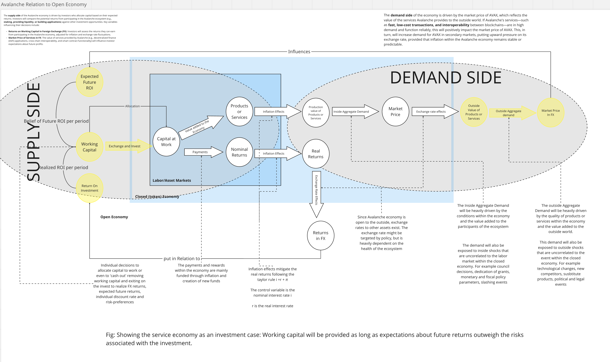
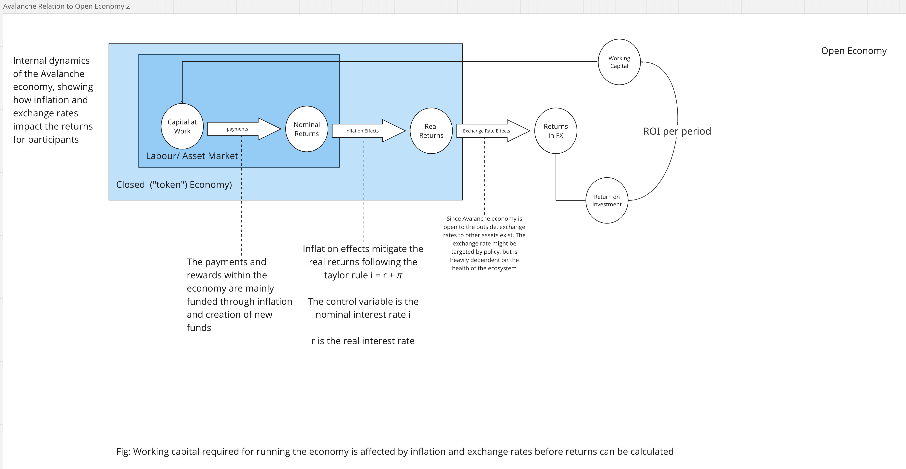

**Last Update:** Feb 13, 2025  **Draft Stage:** 3rd Draft 

# Avalanche Economy relative to the Open Economy ([Miro Link](https://miro.com/app/board/uXjVL4uu8Yk=/?moveToWidget=3458764614712596346&cot=14))

The Avalanche ecosystem operates within the broader cryptoeconomic landscape,
which is itself a subset of the global real economy. The network’s success
hinges not only on internal factors like governance, validator incentives, and
tokenomics but also on external macroeconomic conditions such as investor
sentiment, regulatory developments, and demand for decentralized applications
(dApps). Key questions to address include:

1. *How will the Avalanche economy evolve over time relative to the open
   economy?*  
2. *How will the value of AVAX, Avalanche's native token, evolve over time, as
   reflected in its exchange rate on secondary markets?*  
3. *How will external demand for products and services built on Avalanche
   evolve, and what factors will drive this demand?*  
4. *How will external demand shocks impact the Avalanche ecosystem and its
   internal activity?*  
5. *Why should external capital be allocated to support the Avalanche economy,
   and how much working capital will be required to sustain it?*  
6. *What metrics will external investors use to evaluate their participation in
   the Avalanche economy?*  
7. *What is the relationship between key economic indicators such as nominal
   and real interest rates, inflation, and exchange rates within the Avalanche
ecosystem?*

---

**Avalanche as an Investment Case**  
****  
The Avalanche economy can be framed as an investment case, where external
investors evaluate the ecosystem based on expected returns and risks. This
framework highlights the relationship between the services Avalanche provides
(e.g., fast transactions, DeFi, interoperability) and the demand for AVAX in
secondary markets.

#### **Key Components and Flow:**

1. **Service Output**:  
   * Represents the value created by Avalanche's services, such as
   decentralized applications (dApps), cross-chain interoperability, and
   enterprise solutions.  
   * The utility and adoption of these services drive demand for AVAX.  
2. **Market Price in FX**:  
   * Reflects the price of AVAX in foreign exchange (FX) markets, influenced by
   the demand for Avalanche's services.  
   * A strong demand for Avalanche's services leads to upward pressure on the
   price of AVAX.  
3. **Investor Expectations**:  
   * Investors assess the potential returns from participating in the Avalanche
   ecosystem (e.g., staking rewards, transaction fees) relative to alternative
   investments.  
   * Key factors include returns on working capital in FX, market price
   stability, and projected network growth.  
4. **Demand for AVAX**:  
   * The demand for AVAX is driven by the value of the services it enables.
   Higher demand for Avalanche's services leads to increased demand for AVAX,
   positively impacting its exchange rate.

---

### **Working Capital, Inflation, and Exchange Rate Effects**

### ****

This section visualizes how working capital (the funds required to operate the
Avalanche economy) is affected by inflation and exchange rates before returns
can be calculated. It shows the interplay between internal economic forces
(e.g., token minting, staking rewards) and external economic forces (e.g.,
exchange rate fluctuations, global market conditions).

#### **Key Components and Flow:**

1. **Working Capital Input**:  
   * Represents the capital invested by participants (e.g., stakers,
   validators, developers) to support the Avalanche network.  
2. **Inflation Effects**:  
   * Shows how the minting of new AVAX tokens (inflation) impacts the
   purchasing power of existing tokens.  
   * High inflation can reduce the value of AVAX, acting as a "participation
   tax" for holders.  
3. **Exchange Rate Effects**:  
   * Illustrates how the exchange rate of AVAX (relative to fiat or other
   cryptocurrencies) affects the real value of returns for investors.  
   * A depreciating exchange rate can erode returns, while a stable or
   appreciating rate can enhance them.  
4. **Returns Calculation**:  
   * Demonstrates how the final returns for investors are calculated after
   accounting for inflation and exchange rate effects.

---

### **Supply and Demand Dynamics**

**Supply Side**:  The **supply side** of the Avalanche economy is driven by
investors who allocate capital based on their expected returns. Investors will
compare the potential returns from participating in the Avalanche ecosystem
(e.g., staking, providing liquidity, or building applications) against other
investment opportunities. Key variables influencing their decisions include:

* Key variables influencing their decisions include:  
  * **Returns on Working Capital in FX:** Investors assess the returns they can
  earn from participating in the Avalanche economy, adjusted for inflation and
  exchange rate fluctuations.  
  * **Market Price of Services in FX:** The value of services provided by
  Avalanche (e.g., DeFi applications, cross-chain interoperability, and smart
  contract functionality) influences investor expectations about future
  profits.

**Demand Side:**  The **demand side** of the economy is driven by the market
price of AVAX, which reflects the value of the services Avalanche provides to
the outside world. If Avalanche's services—such as fast, low-cost transactions,
and interoperability between blockchains—are in high demand and function
reliably, this will positively impact the market price of AVAX. This, in turn,
will increase demand for AVAX in secondary markets, putting upward pressure on
its exchange rate, provided that inflation within the Avalanche economy remains
stable or predictable.

---

### **Inflation and Exchange Rate Effects**

Inflation within the Avalanche ecosystem is primarily driven by the minting of
new AVAX tokens, which are distributed as rewards to validators and stakers.
This inflationary mechanism is designed to incentivize network security and
participation. However, excessive inflation can erode the value of AVAX,
reducing its attractiveness to investors and users. Therefore, managing the
inflation rate is crucial for maintaining the stability and long-term growth of
the Avalanche economy. Exchange rate volatility is another critical factor. As
AVAX is traded on global cryptocurrency exchanges, its price is subject to
fluctuations based on market sentiment, external economic conditions, and the
performance of competing blockchain platforms. A stable and predictable
exchange rate is essential for attracting long-term investors and ensuring the
smooth operation of the Avalanche ecosystem.. 

---

### **Economic Growth and Stability**

For Avalanche to achieve sustained economic growth, it must balance the forces
of inflation and economic expansion. The network's inflation rate acts as an
economic force that impacts the economy, while the value created by Avalanche's
services (e.g., DeFi, NFTs, and enterprise solutions) acts as a
counterbalancing force. To ensure long-term stability, the inflation rate
should ideally remain below the rate of economic growth, allowing the network
to experience aggregate growth over time.

---

### **Key Considerations**

1. **How does AVAX behave relative to fiat and other cryptocurrencies?**  
   * AVAX's value is influenced by its utility within the Avalanche ecosystem
   and its performance relative to other cryptocurrencies and fiat currencies.  
2. **What are the primary economic forces driving external demand for
Avalanche’s services?**  
   * The demand for Avalanche's services is driven by factors such as network
   performance, interoperability, and the adoption of dApps.  
3. **How will macroeconomic shifts (e.g., interest rates, inflation,
regulation) impact Avalanche’s exchange rate?**  
   * Macroeconomic shifts can influence investor sentiment and capital flows,
   impacting AVAX's exchange rate.  
4. **A crucial link between a closed economy (like Avalanche) and the broader
economy is its exchange rate.**  
   * The exchange rate acts as a valve, responding dynamically to both internal
   economic policies and external market forces.  
   * A growing, stable, and secure ecosystem should see positive pressure on
   the AVAX price as long as external demand remains strong.  
   * A decline in AVAX value may indicate inefficiencies, governance failures,
   or capital flight.  
   * A stable or growing AVAX price signals strong investor confidence,
   effective economic policies, and sustained demand for Avalanche's network
   services.  
5. **Avalanche’s inflation and token distribution policies influence its
economy:**  
   * **Staking incentives:** If AVAX supply increases without proportional
   demand growth, staking rewards may become devalued.  
   * **System participation costs**: Holders perceive inflation as a tax that
   reduces the value of their holdings.  
   * **Economic sustainability**: Careless increases in the monetary base could
   destabilize the economy and trigger capital flight.  
6. **Capital allocation within Avalanche follows mechanism design principles:**  
   * **Why should foreign capital be allocated to Avalanche?** Investors
   require competitive returns after inflation and exchange rate effects,
   relative to alternative investment options.  
   * **Key investment metrics:** Foreign investors will assess Avalanche’s
   potential using:  
     * Returns on working capital in FX (fiat currency)  
     * Market price stability in FX  
     * Projected network growth and adoption rates  
   * **Growth rate vs. Price stability trade-offs:** Investors balance the
   risk-reward of AVAX compared to other crypto assets.  
7. **The demand side of Avalanche’s economy is defined by the market price in
FX and the value created by the ecosystem.**  
   * If Avalanche’s interoperability solutions and dApps are highly functional
   and in demand, this strengthens AVAX demand.  
   * Conversely, weak adoption or unreliable network performance reduces its
   attractiveness.  
8. **How will external demand shocks affect Avalanche?**  
   * Sudden capital outflows from crypto markets, regulatory shifts, or
   technological changes could impact participation rates, AVAX pricing, and
   validator behavior.  
9. **What mechanisms mitigate these risks?**  
   * Dynamic governance, algorithmic policy adjustments, and adaptive inflation
   controls can ensure long-term economic stability.

---

### **Key Economic Indicators for the Avalanche Economy** 

1. **Exchange Rate (AVAX/USD):** Trends in the valuation of AVAX against USD.  
2. **Inflation Rate (%):** Changes in the purchasing power of AVAX over time.  
3. **Capital Inflows (M USD)**: Foreign capital entering the Avalanche
ecosystem.  
4. **Market Demand (M transactions**): Growth in dApp usage and network
activity.

### **The Taylor Rule and Its Application to Avalanche**

The Taylor Rule is a monetary policy guideline that suggests how central banks
should adjust interest rates in response to changes in economic conditions,
particularly inflation and economic output. While Avalanche is not a
traditional economy with a central bank, the principles of the Taylor Rule can
be adapted to guide its economic policies.

The basic form of the Taylor Rule is:

$$i = r^* + \pi + 0.5(\pi - \pi^*) + 0.5(Y - Y^*)$$

Where:

* $i$: The nominal interest rate set by the central bank.  
* $r^*$: The neutral real interest rate (the rate that would prevail when the
economy is at full employment and inflation is stable).  
* $\pi$: The current inflation rate.  
* $\pi^*$: The central bank's target inflation rate.  
* $Y$: The actual output (GDP).  
* $Y^*$: The potential output (the level of output the economy can sustain at
full employment).

1. **Neutral Real Interest Rate (*r\**):**  
   * This is the baseline interest rate that would prevail in a stable economy
   with no inflationary or deflationary pressures.  
   * It reflects the time preference of consumers and the productivity of
   capital.  
2. **Inflation Adjustment ():**  
   * The central bank adjusts the interest rate based on the current inflation
   rate ().  
   * If inflation is above the target (***\>\****), the central bank should
   raise interest rates to cool down the economy and bring inflation back to
   target.  
   * If inflation is below the target (***\<\****), the central bank should
   lower interest rates to stimulate the economy.  
3. **Output Gap Adjustment (*Y-Y\**):**  
   * The output gap measures the difference between actual output (***Y***) and
   potential output (***Y\****).  
   * If actual output is below potential (***Y\<Y\****), the economy is
   underperforming, and the central bank should lower interest rates to
   stimulate growth.  
   * If actual output is above potential (***Y\>Y\****), the economy is
   overheating, and the central bank should raise interest rates to prevent
   inflation.  
4. **Coefficients (0.5):**  
   * The coefficients (0.5) represent the relative weights given to inflation
   and output gap in the central bank's decision-making process.  
   * These weights can vary depending on the central bank's priorities, but
   Taylor's original formulation uses 0.5 for both.

The Avalanche economy is deeply interconnected with the broader cryptocurrency
and global economies. Its success depends on maintaining a delicate balance
between inflation, exchange rate stability, and the value of the services it
provides. By carefully managing these factors, Avalanche can attract external
capital, foster sustainable growth, and achieve its long-term objectives as a
leading blockchain platform. The principles of the Taylor Rule can provide
valuable insights into how Avalanche can adapt its economic policies to ensure
stability and growth.
