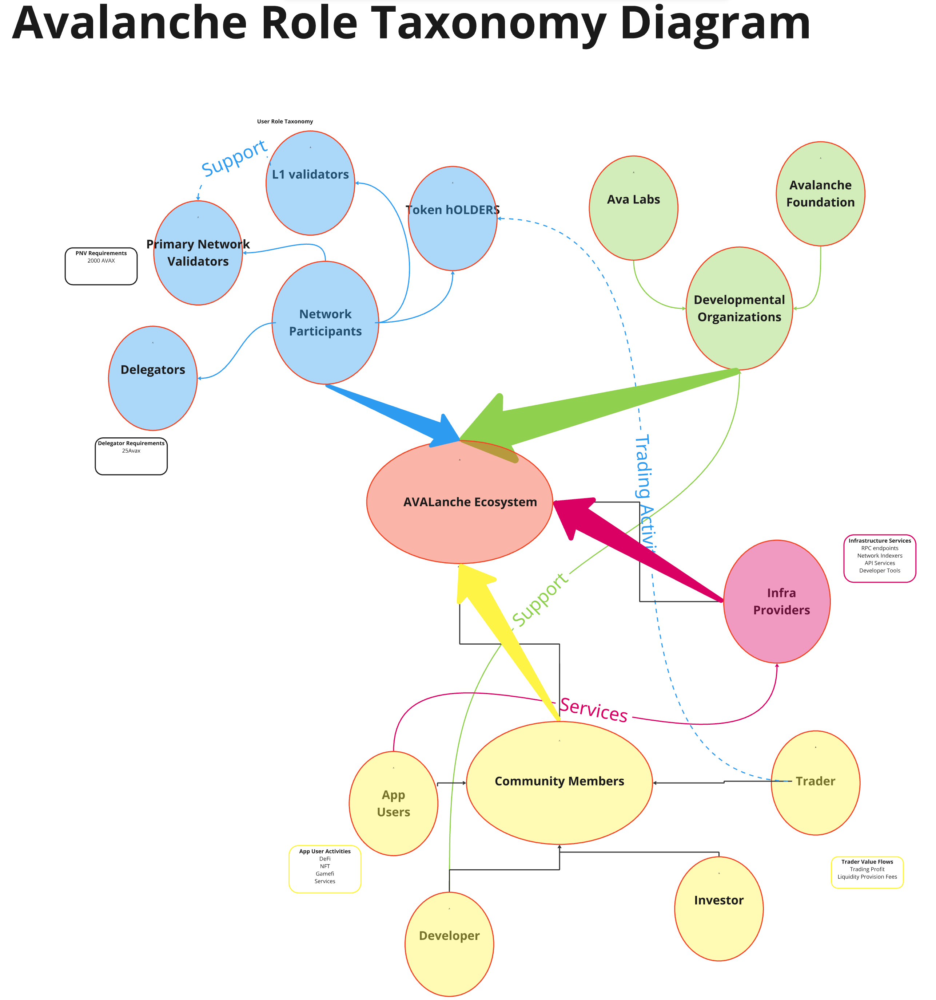

**Last Update:** October 29th, 2025  **Draft Stage:** 3rd Draft

# **Role Taxonomy Overview**

The proposed taxonomy below is intended to reflect the core roles within The
Avalanche Network as they relate to the current and future state of the
ecosystem. Roles specify the incentives and behaviors of sets of network
actors, as well as the actions those actors can execute, and the value flows to
and from those actors. Furthermore, the taxanomy explores the relationships
between roles, and example entities that would take on such roles. The result
is a taxanomy of roles and relationships in the Avalanche Economic Network.
Please note that these roles are not mutually exclusive; thus an entity can
play more than one role.

## 

## Public Actors in the Avax Network:

### Network Participants

* Primary Network Validators  
* L1 Validators  
* Delegators  
* Token Holders

### Development Organizations

* Ava Labs  
* Avalanche Foundation  
* Infrastructure Providers

### Community Members

* App Users  
* Developers  
* Investors  
* Traders

* ## Network Participants

  * ### Primary Network Validator (PNV)

    * **Definition**  
      * Primary Network Validators are the core validators responsible for
      securing the main Avalanche network. They serve as the foundation of
      network security and
      [consensus](Mechanism%20Taxonomy.md#consensus-layer-implementation).  
    * **Parameters**  
      * Minimum [stake](Economic%20Taxonomy.md#staking-mechanism) 2000 AVAX  
      * Minimum delegation amount: 25 AVAX
      * Minimum staking duration: 2 weeks
      * Maximum staking duration: 1 year
      * Maximum validator weight: 3 million AVAX (or 5x the validator's own stake, whichever is less)
    * **Eligibility**  
      * Need to run a node meeting hardware requirements  
      * Must maintain high uptime (\>80%)  
      * Failing this threshold results in NO rewards for the validation period  
      * This affects both validator and delegator rewards  
      * Uptime is measured over each staking period (2 weeks \- 1 year)  
    * **Actions Performed**  
      * Participate in
      [Consensus](Mechanism%20Taxonomy.md#consensus-layer-implementation)  
        * Process
        [Transactions](Mechanism%20Taxonomy.md#three-chain-architecture)  
        * Maintain Network Security  
        * Validate L1s  (Optional)  
    * **Value Flows**  
      * PNVs earn [staking
      rewards](Economic%20Taxonomy.md#validator-incentives) from network
      inflation, collect [transaction
      fees](Economic%20Taxonomy.md#fee-structure) from processed operations,
      and can receive additional fees from L1 validation services.  
    * **Preferences**  
      * These validators typically align with long-term network growth,
      prioritize stable and reliable infrastructure, and focus on maintaining
      high uptime.  
    * **Considerations**  
      * Must account for high capital requirements, possess significant
      technical expertise, and manage substantial infrastructure costs.  
      * Validators are a very important stakeholder group in the network as
      they are committed (through their stake) and will be involved for at
      least the duration of the staking validation period  
    * **Delegation Mechanics**  
      * Can accept [delegated stake](Economic%20Taxonomy.md#staking-mechanism)
      from other token holders, typically setting minimum delegation amounts
      and configuring revenue sharing percentages. They must carefully balance
      delegation rewards to remain competitive while maintaining profitability.  
    * **Technical Operations**  
      * Must run
      [AvalancheGo](https://docs.avax.network/nodes/run/node-manually) nodes
      with specific hardware requirements, implement comprehensive monitoring
      systems, maintain database health, and ensure optimal network
      connectivity. This includes managing [chain
      state](Mechanism%20Taxonomy.md#three-chain-architecture), handling
      upgrades, and monitoring system resources.  
    * **Risk Management**  
      * Face potential slashing for poor performance or malicious behavior.
      They must implement robust security measures, maintain high uptime
      through redundancy, and carefully monitor validation performance metrics.  
    * **Economic Optimization**  
      * These validators optimize [fee
      structures](Economic%20Taxonomy.md#fee-structure), balance delegation
      rewards with operational costs, and develop long-term strategies for
      maximizing returns while maintaining network health.  
    * **Cross-L1 Operations**  
      * Often validate multiple L1s, requiring careful resource allocation and
      management of different validation requirements across networks.

  * ### L1 Validator (L1V)

    * **Definition**  
      * L1 Validators are specialized validators focused on specific
      [L1s](Mechanism%20Taxonomy.md#l1-management), operating within customized
      validation environments.  
    * **Eligibility**  
      * Meet L1-specific requirements/conditions  
      * Custom L1 specific validation periods  
      * May require KYC/permissions  
    * **Actions Performed**  
      * These validators focus on L1-specific [transaction
      validation](Mechanism%20Taxonomy.md#consensus-layer-implementation),   
      * Maintain individual L1 states  
      * execute specialized logic required by their particular L1.  
    * **Value Flows**  
      * L1Vs receive L1-specific rewards, may earn custom token incentives, and
      participate in various [fee-sharing
      models](Economic%20Taxonomy.md#l1-economics) unique to their L1.  
    * **Preferences**  
      * specialize in specific L1 operations  
      * focus on application-specific requirements  
    * **Considerations**  
      * While capital requirements may be lower, L1Vs need specialized
      knowledge of their L1’s operations and must navigate variable reward
      structures.  
    * **Delegation Mechanics**  
      * L1Vs may have L1-specific delegation rules, custom token requirements,
      and unique revenue sharing models based on L1 parameters.  
    * **Technical Operations**  
      * They must maintain specialized infrastructure for L1 validation,
      implement L1-specific monitoring, and manage custom [virtual
      machines](Mechanism%20Taxonomy.md#virtual-machine-components) as required
      by their L1.  
    * **Risk Management**  
      * L1Vs navigate L1-specific slashing conditions, maintain compliance with
      custom validation rules, and manage risks across multiple token types.  
    * **Economic Optimization**  
      *  These validators optimize for L1-specific rewards, balance resources
      across different validation activities, and develop strategies for
      maximizing returns within L1 parameters.  
    * **Cross-**L1 **Operations**  
      * L1Vs must manage interactions between their L1 and the primary network,
      handle cross-L1 messaging, and maintain operational efficiency across
      multiple validation environments.

  * ### Delegator

    * **Definition**  
      * Delegators participate in network security by
      [staking](Economic%20Taxonomy.md#staking-mechanism) AVAX to validators  
      * They can delegate through [Core Wallet](https://core.app) or liquid
      staking protocols  
      * Liquid staking options include [Benqi](https://benqi.fi) and
      [GoGoPool](https://gogopool.com)  
    * **Actions & Responsibilities**  
      * Research and select reliable validators  
      * Monitor validator uptime (critical for rewards)  
      * Manage delegation through Core Wallet or liquid staking  
      * Claim rewards after validation periods  
      * Track validator performance metrics  
    * **Value Flows**  
      * [Stake](Economic%20Taxonomy.md#staking-mechanism) minimum 25 AVAX per
      delegation  
      * Earn [staking rewards](Economic%20Taxonomy.md#validator-incentives)
      (minus validator fee)  
      * No rewards if validator fails minimum uptime requirement  
      * Liquid staking options provide additional flexibility  
    * **Key Considerations**  
      * Validator uptime history is crucial  
      * Choose between direct staking vs liquid staking  
      * Minimum time is 2 weeks and maximum time is 1 year  
      * Reward claiming responsibility  
      * Risk of losing rewards due to poor validator performance

  * ### Token Holder

    * **Definition:**  
      * Primary stakeholders in the Avalanche ecosystem  
      * Hold AVAX tokens with full custody and control  
      * Can transition between multiple participant roles  
      * Key participants in [network
      governance](Mechanism%20Taxonomy.md#governance-components)  
    * **Actions Performed:**  
      * Store and manage AVAX tokens  
      * Participate in [governance
      voting](Mechanism%20Taxonomy.md#voting-process)  
      * [Delegate](Economic%20Taxonomy.md#staking-mechanism) tokens to
      validators  
      * Trade and transfer tokens  
      * Interact with dApps and services  
      * Stake tokens directly as validators  
    * **Value Flows:**  
      * **Inflows:**  
        * Token acquisitions through purchases  
        * [Staking/delegation
        rewards](Economic%20Taxonomy.md#validator-incentives)  
        * Airdrops and incentives  
        * DeFi yields and returns  
      * **Outflows:**  
        * [Transaction fees](Economic%20Taxonomy.md#fee-structure)  
        * Token transfers  
        * Smart contract interactions  
        * [Governance
        participation](Mechanism%20Taxonomy.md#governance-components) costs  
    * **Preferences:**  
      * Asset security and custody  
      * Network governance participation  
      * Return on investment opportunities  
      * Ecosystem utility and growth  
      * Low [transaction costs](Economic%20Taxonomy.md#fee-structure)

* ## Development Organizations

  * ### Ava Labs 

    * **Definition**  
      * Core development organization behind [Avalanche
      Network](https://avax.network)  
      * Research-driven technology company focused on blockchain innovation  
      * Founded by [Emin Gün Sirer](https://www.avalabs.org/team), Kevin
      Sekniqi, and Ted Yin  
    * **Actions Performed**  
      * Core [protocol development](Mechanism%20Taxonomy.md) and maintenance  
      * Infrastructure and tooling development ([Core
      Wallet](https://core.app), SDKs)  
      * Security monitoring and upgrades  
      * Technical documentation and education  
      * Enterprise partnership development  
    * **Value Flows**  
      * Invests in R\&D and protocol innovation  
      * Provides developer tools and resources  
      * Delivers security improvements and updates  
      * Enables ecosystem growth through partnerships  
      * Supports community education and adoption  
    * **Preferences**  
      * Open source development methodology  
      * Research-backed innovation approach  
      * Community-driven improvement process  
      * Security-first engineering practices  
      * Pragmatic solution design

  * ### Avalanche Foundation

    * **Definition:**  
      * The [Avalanche Foundation](https://www.avax.network/foundation) is a
      non-profit entity separate from Ava Labs  
      * Focuses on ecosystem advancement and community growth  
      * Does NOT develop the core protocol (that's Ava Labs)  
      * Manages ecosystem funding and development programs  
    * **Actions Performed:**  
      * Manages ecosystem funding programs and grants  
      * Coordinates [network
      governance](Mechanism%20Taxonomy.md#governance-components) initiatives  
      * Supports developer onboarding and education  
      * Oversees [staking delegation
      rewards](Economic%20Taxonomy.md#validator-incentives) program  
      * Facilitates institutional partnerships and adoption  
      * Provides community incentives and rewards  
    * **Value Flows:**  
      * Manages foundation treasury  
      * Distributes ecosystem grants  
      * Provides staking delegation rewards  
      * Funds community infrastructure  
      * Supports ecosystem growth initiatives

  * ### Infrastructure Providers

    * **Definition**  
      * Organizations providing critical network infrastructure  
      * Operate RPC endpoints, indexers, and APIs  
      * Support network reliability and accessibility  
    * **Actions Performed**  
      * Maintain public RPC endpoints  
      * Operate network indexers  
      * Provide API services  
      * Monitor network health  
      * Support developer tools  
    * **Value Flows**  
      * Generate revenue from API services  
      * Receive infrastructure grants  
      * Monetize premium services  
      * Support ecosystem growth  
    * **Preferences**  
      * High service reliability  
      * Scalable infrastructure  
      * Developer-friendly solutions  
      * Sustainable business models  
        

* ## Community Members

  * ### Trader

    * **Definition:**  
      * Market participants who actively trade AVAX tokens  
      * Provide market liquidity and price discovery  
      * Operate across centralized and decentralized exchanges  
      * May engage in various trading strategies  
    * **Actions Performed:**  
      * Execute token trades and swaps  
      * Provide liquidity to trading pools  
      * Monitor market conditions  
      * Analyze price movements  
      * Manage trading positions  
    * **Value Flows:**  
      * **Inflows:**  
        * Trading profits  
        * Liquidity provision fees  
        * Yield farming rewards  
        * Arbitrage opportunities  
      * **Outflows:**  
        * Trading fees and spreads  
        * [Gas costs](Economic%20Taxonomy.md#fee-structure) for transactions  
        * Liquidity pool deposits  
        * Value at risk  
    * **Preferences:**  
      * High market liquidity  
      * Low [trading fees](Economic%20Taxonomy.md#fee-structure)  
      * Price efficiency  
      * Advanced trading tools  
      * Risk/reward optimization

  * ### Investors

    * **Definition:**  
      * Strategic capital providers to the Avalanche ecosystem  
      * Long-term token holders focused on value appreciation  
      * May include both retail and institutional participants  
    * **Actions Performed:**  
      * Conduct due diligence on projects  
      * Deploy capital strategically  
      * Participate in
      [governance](Mechanism%20Taxonomy.md#governance-components)  
      * Support ecosystem growth  
    * **Value Flows:**  
      * **Inflows:**  
        * Token value appreciation  
        * Staking yields  
        * Ecosystem rewards  
        * Investment returns  
      * **Outflows:**  
        * Initial capital deployment  
        * Operating costs  
        * Portfolio management fees  
        * Value at risk  
    * **Preferences:**  
      * Long-term value creation  
      * Network growth and adoption  
      * Strong governance rights  
      * Risk-adjusted returns

      

  * ### App User

    * **Definition:**  
      * End users of applications built on Avalanche  
      * Interact with dApps, DeFi protocols, and services  
      * May or may not hold AVAX tokens directly  
      * Focus on utility and functionality  
    * **Actions Performed:**  
      * Use DeFi applications and protocols  
      * Engage with GameFi and NFT platforms  
      * Execute transactions and swaps  
      * Interact with smart contracts  
      * Access decentralized services  
    * **Value Flows:**  
      * **Inflows:**  
        * Application utility and benefits  
        * Rewards from protocol usage  
        * Service access and features  
        * Yield from DeFi activities  
      * **Outflows:**  
        * [Transaction fees](Economic%20Taxonomy.md#fee-structure)  
        * Service usage costs  
        * Protocol interaction fees  
        * Subscription payments  
    * **Preferences:**  
      * Low [transaction costs](Economic%20Taxonomy.md#fee-structure)  
      * User-friendly interfaces  
      * Fast transaction speeds  
      * Reliable service access  
      * Strong security features

  * ### Developer

    * **Definition**  
      * Builds applications and services on
      [Avalanche](https://docs.avax.network/)  
      * Creates [smart contracts](Mechanism%20Taxonomy.md#evm-c-chain) and
      protocols  
      * Contributes to ecosystem tooling  
      * Innovates new use cases  
    * **Actions Performed**  
      * Develops dApps and protocols  
      * Writes and deploys [smart
      contracts](https://docs.avax.network/dapps/smart-contracts/)  
      * Creates developer tools and [SDKs](https://docs.avax.network/tooling/)  
      * Tests and audits code  
      * Maintains documentation  
    * **Value Flows**  
      * **Inflows**  
        * Development grants  
        * Protocol fees and revenue  
        * Token incentives  
        * Community rewards  
      * **Outflows**  
        * Development costs  
        * Infrastructure expenses  
        * Testing and auditing fees  
        * Marketing and user acquisition  
    * **Preferences**  
      * Strong developer tooling  
      * Clear documentation  
      * Active support channels  
      * Scalable infrastructure  
      * Engaged user community

#### 

## Role Taxonomy Summary

The Avalanche ecosystem comprises a diverse set of actors working together to
maintain, develop, and grow the network. Network Participants, including
[Primary Network Validators](Economic%20Taxonomy.md#validator-incentives), L1
Validators, and [Delegators](Economic%20Taxonomy.md#staking-mechanism), form
the backbone of network security and operations. Development Organizations like
[Ava Labs](https://avalabs.org) and the [Avalanche
Foundation](https://www.avax.network/foundation) provide technical innovation
and ecosystem support, while Infrastructure Providers ensure reliable network
access and tools. Community Members represent various levels of engagement,
from Token Holders who participate in
[governance](Mechanism%20Taxonomy.md#governance-components) to active Traders
managing market dynamics. Investors provide strategic capital and long-term
support, while App Users drive network adoption through daily interactions.
[Developers](https://docs.avax.network/) create applications and tools that
expand ecosystem utility. 
