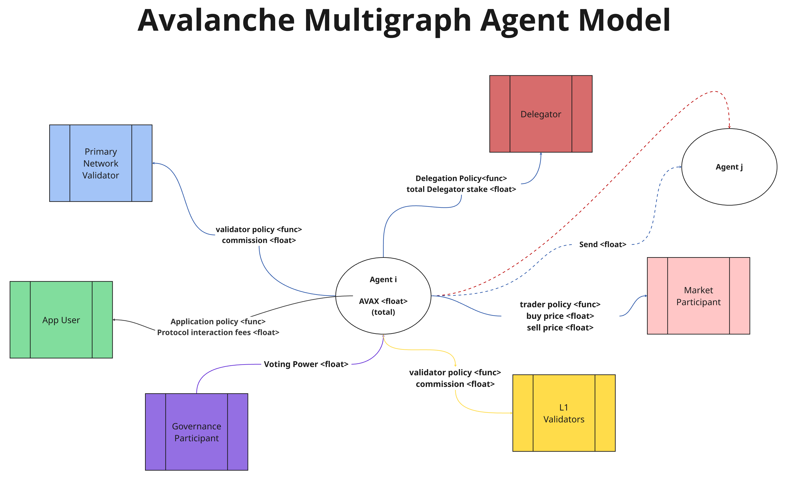

# **Avalanche Economic Model: A Systems Engineering Perspective**

## **Executive Summary**

The Avalanche network represents a **complex adaptive system** where technical
and economic components influence each other continuously. Its unique
architecture of a **Primary Network** with application-specific **Layer 1
blockchains (L1s)** creates distinct economic challenges and opportunities that
require a systems-level understanding to navigate effectively. This analysis
builds upon the foundational understanding established in [[Avalanche Economy
relative to the Open Economy]]. 

This report analyzes the Avalanche blockchain using **model-based systems
engineering (MBSE)** principles. Section one introduces the MBSE methodology
used, and introduces the core economic principles of Avalanche. Section two
decomposes Avalanche into five interconnected subsystems: **Staking Dynamics**,
**Token Supply**, **Fee Dynamics**, **L1 Ecosystem**, and **Governance**. The
interaction of these components are analyzed to consider their creation of
**emergent behaviors**. Section three introduces a **multigraph state-space
model** that captures how participants engage with the system in multiple roles
simultaneously. This approach reveals economic patterns and incentive
structures not visible when viewing each mechanism in isolation.

The remainder of the document explores how these analytical frameworks deliver
practical value through **model applications** for testing economic hypotheses
in order to provide The Avalanche network with **tangible benefits** including
reduced unintended consequences, enhanced adaptability, and improved governance
decision-making. 

## **1\. Introduction: MBSE Applied to Avalanche**

### **1.1 The Need for Model-Based Systems Engineering in Blockchain**

Blockchain protocols are not merely technical infrastructures; they are
**socio-technical systems** where humans and automated agents interact within a
complex framework of incentives and constraints. As Shevchenko notes,
"Model-based systems engineering (MBSE) is a formalized methodology used to
support the requirements, design, analysis, verification, and validation
associated with the development of complex systems"
\[[1](#[1]-shevchenko,-n.-\(2020\).-introduction-to-model-based-systems-engineering.-software-engineering-institute,-carnegie-mellon-university.-retrieved-from-https://insights.sei.cmu.edu/blog/introduction-model-based-systems-engineering-mbse)\].

Traditional economic analyses often examines blockchain mechanisms in isolation,
missing **critical interactions** that lead to unintended consequences. For
instance, when Ethereum transitioned to Proof of Stake, the relationship
between validator economics and network security required a systems approach to
fully understand the emergent properties
\[[2](#[2]-buterin,-v.-et-al.-\(2022\).-ethereum-2.0-specification.-ethereum-foundation.-retrieved-from-https://ethereum.org/en/eth2/)\].

For Avalanche, with its unique **Primary Network** and **L1 architecture**,
understanding the interplay between subsystems is even more critical. Each
component influences others in ways that are difficult to predict without a
systems perspective. For example, changes to fee structures (**ACP-103**) not
only affect user behavior but also impact token supply through burn mechanisms,
which in turn influences staking dynamics
\[[3](#[3]-avalanche-foundation.-\(2023\).-avalanche-community-proposals-\(acps\).-github.-retrieved-from-https://github.com/avalanche-foundation/acps)\].
For detailed technical implementation of these mechanisms, see [[Mechanism
Taxonomy]].

### **1.2 Core Economic Principles of Avalanche**

Avalanche's economic design embodies several key principles that differentiate
it from other blockchain networks (detailed in [[Economic Taxonomy]]):

**Capped Supply with Variable Issuance**: Avalanche has a maximum supply cap of
720 million AVAX tokens, with approximately 457.3 million currently in
circulation as of April 2025
\[[4](#[4]-snowpeer.-\(2025,-april-21\).-avalanche-network-statistics.-retrieved-from-https://snowpeer.io/)\].
Unlike fixed-schedule issuance models like Bitcoin, Avalanche incorporates
governance-adjustable parameters that can modify emission rates in response to
network conditions.

**Deflationary Mechanism Through Fee Burning**: Rather than redistributing
transaction fees to validators (as in Bitcoin or Ethereum's pre-London model),
all transaction fees in Avalanche are burned. This creates a deflationary
pressure that increases with network usage
\[[5](#[5]-ava-labs.-\(2020\).-avalanche-consensus-protocol-whitepaper.-retrieved-from-https://www.avalabs.org/whitepapers)\]\[[4](#[4]-snowpeer.-\(2025,-april-21\).-avalanche-network-statistics.-retrieved-from-https://snowpeer.io/)\].

**Flexible Staking Framework**: Avalanche's staking mechanism allows varied
time commitments (14-365 days) with rewards that scale with duration, creating
natural incentives for long-term network security ([learn more about
staking](https://docs.avax.network/nodes/validate/staking))
\[[5](#[5]-ava-labs.-\(2020\).-avalanche-consensus-protocol-whitepaper.-retrieved-from-https://www.avalabs.org/whitepapers)\].

**Multi-Network Architecture**: Unlike single-chain designs, Avalanche's
Primary Network acts as a security foundation for application-specific L1
blockchains, creating a federation of specialized chains with shared security
([L1 documentation](https://docs.avax.network/build/subnet))
\[[4](#[4]-snowpeer.-\(2025,-april-21\).-avalanche-network-statistics.-retrieved-from-https://snowpeer.io/)\].

**Dynamic Fee Structure**: Introduced in ACP-103 (see [[ACP Summaries]] for
detailed analysis), Avalanche employs a multidimensional fee mechanism that
adjusts based on network congestion across different resource dimensions
(bandwidth, reads, writes, compute)
\[[3](#[3]-avalanche-foundation.-\(2023\).-avalanche-community-proposals-\(acps\).-github.-retrieved-from-https://github.com/avalanche-foundation/acps)\].

**Governance Hysteresis**: Parameter changes in Avalanche include built-in
stability mechanisms to prevent rapid oscillations, a design principle borrowed
from control systems engineering ([governance
overview](https://docs.avax.network/learn/avalanche/avalanche-consensus))
\[[5](#[5]-ava-labs.-\(2020\).-avalanche-consensus-protocol-whitepaper.-retrieved-from-https://www.avalabs.org/whitepapers)\].

**Continuous Fee Model for L1 Validators**: **ACP-77** (see [[ACP Summaries]]
for detailed analysis) introduced a shift from large upfront stakes to a
continuous fee model for L1 validators, reducing barriers to entry while
maintaining security guarantees
\[[3](#[3]-avalanche-foundation.-\(2023\).-avalanche-community-proposals-\(acps\).-github.-retrieved-from-https://github.com/avalanche-foundation/acps)\].

### **1.3 Key Network Participants**

The Avalanche network comprises several types of participants, each with
distinct roles and incentives (see [[Participant Roles Taxonomy]] for detailed
role definitions and relationships):

**Validators** (≈1,956 nodes as of April 2025\) secure the network by staking
AVAX tokens and participating in the consensus process. They are further
divided into Primary Network validators (1,491) and L1-specific validators
(465)
\[[4](#[4]-snowpeer.-\(2025,-april-21\).-avalanche-network-statistics.-retrieved-from-https://snowpeer.io/)\].

**Delegators** (≈7,560 unique accounts with 40,809 total delegations) are token
holders who stake their AVAX to validators without running nodes themselves,
earning a portion of validation rewards
\[[4](#[4]-snowpeer.-\(2025,-april-21\).-avalanche-network-statistics.-retrieved-from-https://snowpeer.io/)\].

**Users** conduct transactions, interact with applications, and pay fees that
are subsequently burned.

**L1 Validators** (66 active L1s with 27 using the modern architecture)
establish and maintain application-specific blockchains that leverage the
security of the Primary Network
\[[4](#[4]-snowpeer.-\(2025,-april-21\).-avalanche-network-statistics.-retrieved-from-https://snowpeer.io/)\].

**Developers** build applications and services on both the Primary Network and
various L1s.

**Token Holders** maintain AVAX for investment purposes or to use platform
services.

**Governance Participants** Engage in the protocol's decision-making processes
through voting on parameter changes and protocol upgrades.

Understanding how these participants interact across multiple subsystems is
essential for comprehending Avalanche's economic dynamics as a whole. For a
comprehensive analysis of participant interactions and behaviors, see
[[Subsystem_Analysis_and_MultiGraph]].

# **2. System Decomposition: The Three Pillars of Avalanche Economics**

Systems engineering teaches us that complex systems are best understood by
decomposing them into manageable subsystems while carefully analyzing the
interfaces between these components. For Avalanche, we identify three critical
pillars organized into hierarchical layers, containing eight subsystems total
that together form its economic foundation. For detailed mathematical modeling
of these subsystems and their interactions, see [[Subsystem_Analysis_and_MultiGraph]].

## **2.1 Core Economic Subsystems**

The Core Economic Subsystems layer comprises the fundamental economic
primitives that govern token supply, staking incentives, and resource pricing
across the network.

### **2.1.1 Token Economics Subsystem**

The **Token Economics** subsystem governs the creation, destruction, and
circulation of AVAX tokens throughout the ecosystem.

As of the data shown in the architecture diagram, the Avalanche network
maintains a **Total Supply** of 456 million AVAX, with a **Maximum Supply Cap**
of 720 million AVAX. The system exhibits **Annual Inflation** of 3.88% from
staking rewards, offset by **Annual Burning** of 0.06% from transaction fees,
resulting in **Net Inflation** of 3.82%. The network has **Burned 4.6 million
AVAX** to date and maintains **41.3 million AVAX** in locked tokens. At current
rates, the **Time to Maximum Supply** is approximately 27.2 years
[[4](#[4]-snowpeer.-\(2025,-april-21\).-avalanche-network-statistics.-retrieved-from-https://snowpeer.io/)].

The supply constantly evolves through several flow processes, including the
**Issuance Rate** (new tokens created through staking rewards at 3.88%
annually), **Burning Rate** (tokens permanently removed through transaction
fees at 0.06% annually), **Net Inflation** (3.82% representing the difference
between issuance and burning), and **Unlock Rate** (tokens becoming available
from vesting schedules).

The token economics subsystem exhibits classic **feedback behaviors**. For
instance, as network usage increases, more fees are burned, reducing the
circulating supply and potentially increasing token value. This value increase
may attract more users, creating a **positive feedback loop**. However, there
are **counterbalancing forces**: as token value increases, the dollar cost of
using the network also rises, potentially dampening adoption. This balance
between opposing feedbacks is a hallmark of **complex systems** that cannot be
understood through linear analysis alone. The token economics subsystem also
demonstrates **control theory principles**, as the system must balance between
inflation (to reward security providers) and deflation (to capture value from
usage). The mathematical treatment of these control dynamics is provided in
[[Differential_Specification]]. The locked supply of 41.3 million AVAX creates
predictable unlock schedules that must be factored into long-term economic
modeling.

### **2.1.2 Staking Ecosystem Subsystem**

The **Staking Ecosystem** subsystem forms the backbone of Avalanche's security
model, encompassing all mechanisms related to token staking, delegation, and
reward distribution.

According to the architecture diagram, the network maintains **217 million AVAX
staked (47.6% of total supply)** across **3,011 validators** and **7,345
delegators**. The **Current APR** stands at 6.17%, generating **26,555 AVAX per
day** in staking rewards. The **Minimum Stake** requirement is 2,000 AVAX for
validators, with **32.8 million AVAX** in total delegations. The system
exhibits a **Re-staking Rate** of approximately 67%, indicating that validators
typically reinvest a significant portion of their rewards
[[4](#[4]-snowpeer.-\(2025,-april-21\).-avalanche-network-statistics.-retrieved-from-https://snowpeer.io/)].

Staking in Avalanche is not static but represents a **continuous flow** of
tokens in and out of the staking pool. Key flow variables include the **New
Stake Rate** (the rate at which new tokens enter the staking system), **Unstake
Rate** (the rate at which tokens exit the staking system), **Reward
Distribution** (generating 26,555 AVAX daily based on participation and
duration), and **Restaking Behavior** (with a 67% re-staking rate indicating
validators reinvest rewards more frequently than delegators).

The staking system operates within constraints defined by several key
parameters: **Minimum Validator Stake** of 2,000 AVAX, **Maximum Validator
Stake** of 3,000,000 AVAX, **Minimum Delegator Stake** of 25 AVAX, **Staking
Duration** of 14-365 days (with rewards scaling based on duration),
**Delegation Fee Range** starting at 2% and set by validators, and **Maximum
Delegation Weight** of 5× the validator's own stake
[[5](#[5]-ava-labs.-\(2020\).-avalanche-consensus-protocol-whitepaper.-retrieved-from-https://www.avalabs.org/whitepapers)].

The staking subsystem exemplifies the need for **systems thinking** in
blockchain design. The staking reward function incorporates both global network
parameters and individual staking choices, creating a **complex adaptive
system** where changes in one component ripple throughout the network. The
reward function incorporates factors including total supply cap, current
supply, individual stake amount, staking duration, and network-wide staking
participation. This creates a system where individual decisions aggregate to
influence network-wide economic conditions, which in turn affect future
individual decisions—a classic **feedback loop** that requires systems modeling
to fully understand. The mathematical formalization of these feedback dynamics
is detailed in [[Differential_Specification]]. The current 47.6% staking ratio
represents an **equilibrium point** where the incentives for staking versus
using tokens for transactions or other purposes have balanced out across the
network.

### **2.1.3 Fee Structure Subsystem**

The **Fee Structure** subsystem governs how users pay for network resources and
how these payments affect the broader economy.

According to the architecture diagram, **all fees are burned** rather than
redistributed to validators, with a **Daily Burn Rate** of 749 AVAX. The fee
model is **multidimensional**, accounting for four distinct resource types as
specified in ACP-103: **Bandwidth (B)** for transaction size, **Reads (R)** for
state database queries, **Writes (W)** for state modifications, and **Compute
(C)** for CPU time required for execution
[[3](#[3]-avalanche-foundation.-\(2023\).-avalanche-community-proposals-\(acps\).-github.-retrieved-from-https://github.com/avalanche-foundation/acps)].

This **multidimensional approach** creates a more accurate pricing mechanism
for network resources, a principle borrowed from systems engineering where
complex resources require nuanced allocation mechanisms. Rather than a
one-dimensional gas price, each resource type can be priced independently based
on its scarcity and demand.

The fee mechanism employs an **exponential controller** that adjusts prices
based on network congestion: When network usage exceeds the target capacity,
fees increase exponentially, quickly pricing out lower-value transactions. When
usage falls below capacity, fees decrease gradually, making the network more
accessible. This approach, inspired by **control systems engineering**,
maintains network stability while maximizing utility. The fee adjustment
algorithm introduced in ACP-103 represents a classic **feedback control
system**
[[3](#[3]-avalanche-foundation.-\(2023\).-avalanche-community-proposals-\(acps\).-github.-retrieved-from-https://github.com/avalanche-foundation/acps)].

The fee subsystem illustrates how **control theory** can be applied to
blockchain economics. The exponential controller provides rapid response to
congestion while preventing fee volatility during normal operation. This
approach recognizes that blockchain networks, like other complex systems,
require **feedback mechanisms** that respond proportionally to disturbances. A
fixed fee would either be too high during low demand (reducing accessibility)
or too low during high demand (causing congestion). The daily burn rate of 749
AVAX (approximately 273,385 AVAX annually) represents a significant
deflationary force that scales with network adoption.

## **2.2 Network Architecture Subsystems**

The Network Architecture Subsystems layer defines the structural components
that enable Avalanche's multi-chain ecosystem and consensus mechanisms.

### **2.2.1 Primary Network Subsystem**

The **Primary Network** subsystem serves as the foundation for Avalanche's
multi-chain architecture, providing the base layer for security, staking, and
cross-chain coordination.

The Primary Network comprises three specialized chains, each optimized for
specific functions: The **P-Chain (Platform Chain)** manages validator
coordination, staking, and subnet/L1 creation. The **C-Chain (Contract Chain)**
provides EVM compatibility for smart contracts and decentralized applications.
The **X-Chain (Exchange Chain)** facilitates fast, low-cost asset transfers and
exchanges. The network maintains **1,417 validators** dedicated to securing
these core chains
[[4](#[4]-snowpeer.-\(2025,-april-21\).-avalanche-network-statistics.-retrieved-from-https://snowpeer.io/)].

This **separation of concerns**—a fundamental principle in systems
design—allows each chain to optimize for its specific use case while
maintaining interoperability. The P-Chain's role in validator management
creates the **security substrate** upon which all L1 chains depend. The
C-Chain's EVM compatibility enables developer familiarity and ecosystem
migration, while the X-Chain provides optimized asset transfer capabilities.

The Primary Network demonstrates how **modular architecture** can be applied to
blockchain design. By separating platform operations (P-Chain), smart contract
execution (C-Chain), and asset exchange (X-Chain), Avalanche achieves both
specialization and coherence. This architecture prevents the "monolithic
blockchain" problem where a single chain must make compromises across competing
objectives. The 1,417 Primary Network validators provide the **base security
layer** that extends to all connected L1 chains, creating a hub-and-spoke model
of shared security
[[4](#[4]-snowpeer.-\(2025,-april-21\).-avalanche-network-statistics.-retrieved-from-https://snowpeer.io/)].

### **2.2.2 L1 Ecosystem Subsystem**

Avalanche's unique **multi-chain architecture** creates a distinct economic
subsystem around Layer 1 blockchains that leverage the Primary Network's
security.

According to the architecture diagram, the network supports **53 active L1
chains** (comprising 14 modern L1s with continuous fees and 39 legacy
subnet-based chains) maintained by **1,594 L1 validators**. The L1 ecosystem
generates **21,959 AVAX annually in fees** through the continuous fee model. L1
chains show strong **sector diversification**, with **Gaming representing
29.6%** and **Finance at 5.6%** of all chains
[[4](#[4]-snowpeer.-\(2025,-april-21\).-avalanche-network-statistics.-retrieved-from-https://snowpeer.io/)].

A key innovation introduced in ACP-77 is the **continuous fee model** for L1
validators
[[3](#[3]-avalanche-foundation.-\(2023\).-avalanche-community-proposals-\(acps\).-github.-retrieved-from-https://github.com/avalanche-foundation/acps)].
Instead of large upfront stakes, validators pay a continuous fee based on
network congestion. The model includes a **Base Fee Rate** of 512 nAVAX/second
(~1.33 AVAX/month) when the network is below target capacity, a **Scaling
Mechanism** where fees increase exponentially as the number of validators
approaches and exceeds the target capacity (10,000 validators), and a
**Capacity Ceiling** with a maximum capacity set at 20,000 validators. This
approach applies principles from **queuing theory** and **congestion pricing**,
concepts frequently used in systems engineering for resource allocation in
complex networks.

The L1 ecosystem demonstrates how **modular design principles** from systems
engineering can be applied to blockchain architecture. By separating
application-specific chains from the security layer, Avalanche achieves both
specialization and scale. This **separation of concerns** allows each L1 to
optimize for its specific use case while leveraging shared security
infrastructure. The continuous fee model creates an elegant economic mechanism
that balances accessibility with sustainable growth.

The diversity of L1 applications (with gaming representing 29.6% of all chains)
demonstrates **market-driven specialization** emerging from the modular
architecture
[[4](#[4]-snowpeer.-\(2025,-april-21\).-avalanche-network-statistics.-retrieved-from-https://snowpeer.io/)].
Each domain can optimize its blockchain parameters—block time, gas limits,
precompiles—without compromising the security or performance of other
applications. The 1,594 L1 validators collectively contribute to both
application-specific security and the broader network effects.

### **2.2.3 Consensus Mechanisms Subsystem**

The **Consensus Mechanisms** subsystem encompasses the technical protocols that
enable validators to agree on network state across different chain types.

According to the architecture diagram, Avalanche employs multiple consensus
protocols optimized for different use cases: **Avalanche Consensus** for
DAG-based chains providing sub-second finality, **Snowman++** for linear chains
offering total ordering and EVM compatibility, **BLS Signatures** with 100%
adoption across the network enabling efficient signature aggregation, and **AWM
(Avalanche Warp Messaging)** facilitating secure cross-chain messaging between
L1s
[[5](#[5]-ava-labs.-\(2020\).-avalanche-consensus-protocol-whitepaper.-retrieved-from-https://www.avalabs.org/whitepapers)].

The dual consensus approach reflects a fundamental **systems engineering
tradeoff**: DAG-based Avalanche consensus maximizes throughput and parallelism
for asset transfers (X-Chain), while linear Snowman++ consensus provides the
total ordering required for smart contract execution (C-Chain) and many L1s.
This is not a design limitation but rather an **optimization for different
requirements**.

The achievement of **100% BLS signature adoption** represents a significant
technical milestone. BLS (Boneh-Lynn-Shacham) signatures enable **signature
aggregation**, where multiple validator signatures can be combined into a
single compact signature. This dramatically reduces the bandwidth and storage
requirements for cross-chain messaging and validator set proofs. From a systems
perspective, BLS adoption creates a more **scalable coordination layer** as the
network grows
[[4](#[4]-snowpeer.-\(2025,-april-21\).-avalanche-network-statistics.-retrieved-from-https://snowpeer.io/)].

**Avalanche Warp Messaging (AWM)** serves as the native **cross-chain
communication protocol**, enabling L1s to send authenticated messages without
relying on external bridges or oracles. AWM leverages BLS signature aggregation
to create efficient proofs of validator attestation, demonstrating how
technical components interact to enable system-level capabilities. This
integrated approach to cross-chain messaging reflects **defense in depth**
principles from security engineering—rather than relying on external trust
assumptions, AWM is secured by the same validator set that secures the chains
themselves.

## **2.3 Governance & Value Flow Subsystems**

The Governance & Value Flow layer encompasses the decision-making mechanisms
and economic flows that enable network adaptation and value distribution.

### **2.3.1 Governance System Subsystem**

The **Governance System** subsystem enables the Avalanche network to adapt and
evolve while maintaining stability.

According to the architecture diagram, Avalanche employs **Parameter
Governance** focused on adjusting economic parameters rather than arbitrary
code execution. The system implements a **Hysteresis Mechanism** that prevents
rapid changes and maintains stability. Governance operates through **Avalanche
Community Proposals (ACPs)**, with major proposals including ACP-77 (continuous
L1 fees), ACP-103 (dynamic fee mechanism), and ACP-125 (fee burning
enhancements). The network shows **Geographic Decentralization** across the US,
Germany, Ireland, and Japan
[[3](#[3]-avalanche-foundation.-\(2023\).-avalanche-community-proposals-\(acps\).-github.-retrieved-from-https://github.com/avalanche-foundation/acps)].

Avalanche's governance model focuses on **parameter-based changes** where
specific network variables can be adjusted through governance processes. These
include staking reward rates, fee calculation parameters, L1 validator capacity
targets, and other economic and technical parameters. This constrained approach
prevents the governance equivalent of "arbitrary code execution"
vulnerabilities while still enabling meaningful adaptation.

A unique feature of Avalanche's governance is the concept of **"hysteresis" or
change resistance**
[[5](#[5]-ava-labs.-\(2020\).-avalanche-consensus-protocol-whitepaper.-retrieved-from-https://www.avalabs.org/whitepapers)].
This mechanism prevents parameters from changing too quickly or too
dramatically, providing stability while still allowing adaptation. For a
parameter change to be valid, it must satisfy **maximum change rate
constraints** based on time since last change and **minimum time interval
between changes**. This approach borrows directly from control systems
engineering, where hysteresis is used to prevent oscillation in feedback
systems.

The governance subsystem exemplifies how systems thinking can be applied to
organizational structures in blockchain networks. Rather than viewing
governance as separate from the technical protocol, Avalanche integrates
governance capabilities directly into the system design. This integration
creates a **self-modifying system** capable of adaptation without
destabilization—a key characteristic of resilient complex systems. The
hysteresis mechanisms prevent the governance equivalent of "thrashing" in
computer systems, where rapid changes lead to inefficiency and instability.

The geographic decentralization of validators across multiple continents
reduces the risk of regulatory or infrastructure concentration, creating a more
**robust governance substrate**. This distribution reflects **systems
resilience** principles where diversity in the decision-making population leads
to more stable outcomes.

### **2.3.2 Value Flow System Subsystem**

The **Value Flow System** subsystem maps how economic value moves through the
network, connecting stakeholders and creating incentive alignment.

According to the architecture diagram, value flows through four primary
channels: **Staking Rewards Flow** from the protocol to validators and
delegators, **Transaction Fee Flow** from users to fee burning (removing tokens
from supply), **L1 Validator Fee Flow** from L1 validators to fee burning, and
**Cross-L1 Value Transfer** enabled by AWM for native cross-chain asset
movement.

The **Staking Rewards Flow** represents the primary **value distribution
mechanism** for network security providers. The protocol generates 26,555 AVAX
daily in staking rewards (approximately 9.7 million AVAX annually), which flows
to the 3,011 validators and 7,345 delegators based on their stake proportions
and duration commitments. With a 67% re-staking rate, a significant portion of
this value immediately recirculates back into the staking pool, creating a
**positive feedback loop** that reinforces network security.

The **Transaction Fee Flow** creates a **value capture mechanism** that
benefits all token holders through supply reduction. With 749 AVAX burned daily
(273,385 AVAX annually), transaction fees create deflationary pressure that
scales with network usage. This flow represents a fundamental **systems design
choice**: rather than redistributing fees to validators (which could create
perverse incentives), Avalanche burns fees to align validator incentives with
long-term token value rather than short-term fee extraction.

The **L1 Validator Fee Flow** generates 21,959 AVAX annually from 1,594 L1
validators, adding to the deflationary pressure from transaction fees. This
flow creates a direct link between L1 ecosystem growth and token scarcity—as
more applications build on Avalanche through L1s, the burn rate increases
proportionally. From a systems perspective, this creates **alignment between
adoption and token value** without requiring complex redistribution mechanisms.

**Cross-L1 Value Transfer** enabled by AWM represents a critical
**interoperability mechanism**. Unlike external bridges that introduce
additional trust assumptions and value leakage, AWM enables native asset
transfers between L1s secured by the validator set. This creates a
**closed-loop value system** where assets can move freely within the Avalanche
ecosystem without value extraction by third-party bridge operators.

The value flow system demonstrates how **careful interface design** can create
aligned incentives across diverse stakeholders. Validators receive rewards for
security, users' fee payments reduce supply benefiting all holders, L1s
contribute to burn rate scaling with their adoption, and AWM enables value
movement without value leakage. This creates a **coherent economic system**
where individual rational behavior aggregates to beneficial network-level
outcomes.

## **2.4 Subsystem Interactions and Emergent Properties**

The true power of systems engineering emerges not in the analysis of individual
components but in understanding their **interactions**. In Avalanche, several
critical interaction points create network-wide behaviors:

The **Token Economics-Staking Ecosystem Feedback Loop**: Staking rewards
increase the token supply at 3.88% annually, while the 47.6% of tokens staked
affects reward distribution and creates natural scarcity. This creates a
dynamic equilibrium between inflation and security.

The **Fee Structure-Token Economics Balance**: The daily burn of 749 AVAX
(273,385 AVAX annually) creates deflationary pressure that increases with
network usage, counterbalancing the inflationary pressure from staking rewards.
The current net inflation of 3.82% represents the difference between these
opposing forces.

The **Primary Network-L1 Ecosystem Security Coupling**: The 1,417 Primary
Network validators provide the security foundation that 53 L1s with 1,594
validators build upon. This creates a **hub-and-spoke security model** where L1
security derives from Primary Network security.

The **Consensus Mechanisms-Value Flow Integration**: The 100% BLS adoption
enables efficient AWM cross-chain messaging, which in turn enables the cross-L1
value transfer flows. Technical capabilities enable economic flows.

The **Governance System-All Subsystems Meta-Coupling**: Governance can adjust
parameters across all subsystems through ACPs, but the hysteresis mechanism
prevents rapid changes. This creates a **controlled adaptation capability**
that affects the entire system.

These interactions create **emergent properties** not visible when examining
each subsystem in isolation:

**Economic Equilibria**: The system naturally tends toward specific equilibrium
states where the 47.6% staking participation, 749 AVAX daily burn rate, and 53
active L1s balance each other. Small perturbations are absorbed through
negative feedback, while large shocks may push the system to new equilibrium
points.

**Self-Regulation**: Price mechanisms and incentive structures enable the
network to self-regulate in response to changing conditions. The 29.6% gaming
sector dominance in L1s demonstrates market-driven specialization without
central planning.

**Parameter Sensitivity**: Certain parameters have outsized influence on system
behavior. The staking APR of 6.17%, fee burning rate, and L1 continuous fee
structure create leverage points for governance interventions.

**Resilience Through Redundancy**: The multi-chain architecture (P/C/X chains
plus 53 L1s) creates functional redundancy where failures in one subsystem
don't cascade. The geographic decentralization across US, Germany, Ireland, and
Japan adds physical redundancy.

A systems perspective also reveals potential **vulnerabilities and resilience
patterns**:

**Parameter Coupling**: Changes to staking rewards affect the inflation rate,
which influences token value, which affects staking incentives—creating a
coupled system requiring holistic analysis.

**Stress Testing**: The system must handle scenarios like: rapid L1 growth
approaching the 10,000 validator target (exponentially increasing L1 fees),
sudden unstaking events reducing the 47.6% staking ratio (potentially affecting
security), or extreme fee burning scenarios (accelerating deflation beyond the
3.82% net inflation target).

**Feedback Loop Management**: The 67% re-staking rate creates a positive
feedback loop that must be monitored to ensure it doesn't lead to excessive
concentration. The exponential L1 fee scaling provides negative feedback to
prevent validator oversupply.

This subsystem analysis reveals Avalanche as a **carefully designed complex
system** where eight major subsystems interact through well-defined interfaces
to create a coherent economic and technical platform. The systems engineering
approach—decomposing the whole, analyzing parts, and synthesizing understanding
of interactions—provides the framework for understanding and improving this
sophisticated blockchain ecosystem.

## **3\. Beyond Mechanism Design: The Multigraph Agent Model**

While **subsystem analysis** (detailed in
[[Subsystem_Analysis_and_MultiGraph]]) provides valuable insights into
Avalanche's economic structure, it still treats participants as idealized
actors within separate mechanisms
\[[1](#[1]-shevchenko,-n.-\(2020\).-introduction-to-model-based-systems-engineering.-software-engineering-institute,-carnegie-mellon-university.-retrieved-from-https://insights.sei.cmu.edu/blog/introduction-model-based-systems-engineering-mbse)\]\[[8](#[8]-zargham,-m.,-&-ben-meir,-i.-\(2023,-august-3\).-block-by-block:-managing-complexity-with-model-based-systems-engineering.-blockscience-blog.-https://blog.block.science/block-by-block-managing-complexity-with-model-based-systems-engineering/)\].
In reality, participants engage with **multiple aspects of the system
simultaneously**, creating **complex behavioral patterns** that require a more
sophisticated modeling approach to fully understand and predict.  

The diagram illustrates the **Multigraph Agent Model (MAM)** for Avalanche's
economic system, demonstrating how a single agent can simultaneously
participate in **multiple network roles**. The central node (**Agent i)**
maintains **AVAX token holdings** while engaging across six distinct roles:
Primary Network Validator, App User, Governance Participant, Delegator, Market
Participant, and L1 Validator. Each connection represents **role-specific
policies and interactions**, such as validator commission rates, application
fees, voting power, delegation policies, and trading strategies. The model
captures **cross-role strategic integration**, showing how decisions in one
domain influence behaviors in others. This multi-dimensional representation
reveals **emergent economic patterns** and **incentive structures** not visible
in traditional single-role economic models, enabling more accurate analysis of
participant behavior in Avalanche's complex ecosystem.

## **3.1 The Limitations of Traditional Economic Models**

Traditional blockchain economic models operate under several restrictive
assumptions that limit their applicability to complex systems like Avalanche
\[[2](#[2]-buterin,-v.-et-al.-\(2022\).-ethereum-2.0-specification.-ethereum-foundation.-retrieved-from-https://ethereum.org/en/eth2/)\]\[[5](#[5]-ava-labs.-\(2020\).-avalanche-consensus-protocol-whitepaper.-retrieved-from-https://www.avalabs.org/whitepapers)\].
These models typically assume participants act within a **single role**
(validator OR delegator OR user), with decisions in one role having no
influence on decisions in another role. They further presume participants
possess **perfect information** about the system and exhibit strictly
**rational behavior** in their decision-making processes. Such simplifications,
while useful for initial analysis, create significant blind spots when
analyzing real-world blockchain economies
\[[8](#[8]-zargham,-m.,-&-ben-meir,-i.-\(2023,-august-3\).-block-by-block:-managing-complexity-with-model-based-systems-engineering.-blockscience-blog.-https://blog.block.science/block-by-block-managing-complexity-with-model-based-systems-engineering/)\].

The reality of blockchain participation is far more nuanced and interconnected.
A single entity in the Avalanche ecosystem frequently occupies multiple roles
simultaneously—validating on the **Primary Network**, operating an **L1
chain**, participating in **governance proposals**, and strategically trading
tokens based on **market conditions**
\[[4](#[4]-snowpeer.-\(2025,-april-21\).-avalanche-network-statistics.-retrieved-from-https://snowpeer.io/)\]\[[7](#[7]-ava-labs.-\(2019\).-the-avalanche-platform:-enabling-internet‑scale-decentralized-applications.-retrieved-from-https://www.avalabs.org/whitepapers)\].
Data from April 2025 shows significant overlap between the 1,491 Primary
Network validators, the 465 L1 validators, and the 1,401 governance
participants
\[[4](#[4]-snowpeer.-\(2025,-april-21\).-avalanche-network-statistics.-retrieved-from-https://snowpeer.io/)\].
These overlapping responsibilities create decision frameworks where actions in
one domain necessarily influence strategies in others. For example, a validator
who also operates an L1 chain might make different staking decisions than one
who focuses solely on validation
\[[3](#[3]-avalanche-foundation.-\(2023\).-avalanche-community-proposals-\(acps\).-github.-retrieved-from-https://github.com/avalanche-foundation/acps)\].
This intricate web of cross-domain decision-making creates **complex strategic
behaviors** that traditional single-role economic models fundamentally fail to
capture or predict.

## **3.2 Introducing the Multigraph State-Space Model**

To address these limitations and more accurately represent the economic
dynamics of the Avalanche network, we propose a **Multigraph State-Space Model
(MSSM)** (see [[Subsystem_Analysis_and_MultiGraph]] for detailed
implementation). This innovative modeling approach explicitly represents the
multifaceted nature of blockchain participation by treating each participant as
a potential multi-role agent. The MSSM framework incorporates several
fundamental improvements over traditional models, beginning with its
recognition of **agents as multi-role participants** who can simultaneously
occupy and balance multiple positions within the ecosystem
\[[8](#[8]-zargham,-m.,-&-ben-meir,-i.-\(2023,-august-3\).-block-by-block:-managing-complexity-with-model-based-systems-engineering.-blockscience-blog.-https://blog.block.science/block-by-block-managing-complexity-with-model-based-systems-engineering/)\].

The MSSM approach acknowledges that agents maintain **role-specific states and
strategies**—distinct state variables and decision functions for each role they
occupy. This granular representation allows the model to capture how
participants might optimize differently across their various responsibilities.
The model also accounts for **cross-role strategic integration**, recognizing
that decisions made in one role inevitably influence decisions in others,
creating complex feedback loops and strategic dependencies
\[[8](#[8]-zargham,-m.,-&-ben-meir,-i.-\(2023,-august-3\).-block-by-block:-managing-complexity-with-model-based-systems-engineering.-blockscience-blog.-https://blog.block.science/block-by-block-managing-complexity-with-model-based-systems-engineering/)\].
Perhaps most importantly, the MSSM explicitly models **interaction
networks**—the multidimensional relationships between agents across different
roles—providing a structural foundation for understanding emergent economic
behaviors.

This sophisticated framework enables us to model nuanced behaviors that would
be invisible in traditional economic analyses. For instance, it can capture how
validators might optimize their **delegation fees** in response to broader
market conditions rather than just staking dynamics
\[[4](#[4]-snowpeer.-\(2025,-april-21\).-avalanche-network-statistics.-retrieved-from-https://snowpeer.io/)\],
how L1 Validators adjust their **validation strategies** based on pending
governance proposals that might affect their operations
\[[3](#[3]-avalanche-foundation.-\(2023\).-avalanche-community-proposals-\(acps\).-github.-retrieved-from-https://github.com/avalanche-foundation/acps)\],
or how savvy token holders time their **market activities** to coincide with
predictable staking reward distributions
\[[6](#[6]-ava-labs.-\(2020\).-avalanche-platform-whitepaper.-retrieved-from-https://www.avalabs.org/whitepapers)\].
These behavioral patterns, while common in practice, remain invisible to
single-role economic models.

## **3.3 Model Structure and Components**

The MSSM represents each agent in the Avalanche ecosystem as a multidimensional
**node** with several key attributes. Each agent maintains specific **token
holdings** (their balance state), a set of **role assignments** (which may
include validator, delegator, L1 validator, governance participant, trader,
etc.), **strategy functions** that determine their decision-making processes
for each assigned role, and a comprehensive **history of interactions** that
influences future decisions
\[[6](#[6]-ava-labs.-\(2020\).-avalanche-platform-whitepaper.-retrieved-from-https://www.avalabs.org/whitepapers)\]\[[9](#[9]-ava-labs.-\(2020\).-avalanche-network-documentation.-retrieved-from-https://docs.avax.network/)\].
This rich representation allows the model to capture the full complexity of
agent behavior across multiple domains.

Each role within the system carries specific attributes and behavioral patterns
that influence agent decision-making. The **Validator Role** incorporates
factors such as staking amount, commission rate, and performance metrics that
shape validation strategy
\[[5](#[5]-ava-labs.-\(2020\).-avalanche-consensus-protocol-whitepaper.-retrieved-from-https://www.avalabs.org/whitepapers)\]\[[9](#[9]-ava-labs.-\(2020\).-avalanche-network-documentation.-retrieved-from-https://docs.avax.network/)\].
The **Delegator Role** includes delegation amounts, validator selection
criteria, and reward history that influence delegation decisions—particularly
relevant given the 7,560 unique delegators managing 40,809 delegation positions
\[[4](#[4]-snowpeer.-\(2025,-april-21\).-avalanche-network-statistics.-retrieved-from-https://snowpeer.io/)\].
The **Governance Participant Role** encompasses voting history and proposal
participation patterns that reveal governance preferences
\[[3](#[3]-avalanche-foundation.-\(2023\).-avalanche-community-proposals-\(acps\).-github.-retrieved-from-https://github.com/avalanche-foundation/acps)\].
The **Trader Role** captures trading strategies and market influence that
affect token price dynamics. The **L1 Validator Role** includes chain
parameters and validator recruitment strategies that shape L1 ecosystem
development
\[[3](#[3]-avalanche-foundation.-\(2023\).-avalanche-community-proposals-\(acps\).-github.-retrieved-from-https://github.com/avalanche-foundation/acps)\]\[[7](#[7]-ava-labs.-\(2019\).-the-avalanche-platform:-enabling-internet‑scale-decentralized-applications.-retrieved-from-https://www.avalabs.org/whitepapers)\].
By modeling these roles with appropriate depth, the MSSM achieves a level of
behavioral realism impossible in simpler economic models.

The true innovation of the MSSM lies in its multigraph structure, which
captures multiple types of relationships between agents and roles. **Agent-Role
Edges** connect agents to their assigned roles, defining the functional
capacities each agent possesses within the system. **Agent-Agent Edges**
represent direct relationships between agents, such as delegation connections
or transaction patterns, revealing the social and economic networks that
influence decision-making. **Role-Mediated Edges** represent more subtle
relationships between agents through shared roles, capturing how agents might
influence each other indirectly through role-specific behaviors and
expectations. This multilayered network structure creates a rich representation
of the complex social and economic interactions that form within the Avalanche
ecosystem, enabling analysis of emergent behaviors that arise from these
interconnections
\[[8](#[8]-zargham,-m.,-&-ben-meir,-i.-\(2023,-august-3\).-block-by-block:-managing-complexity-with-model-based-systems-engineering.-blockscience-blog.-https://blog.block.science/block-by-block-managing-complexity-with-model-based-systems-engineering/)\].

## **3.4 Agent Behavior and Emergent Phenomena**

The MSSM's power becomes evident when we examine how it captures the
integration of strategies across roles. The model reveals how
**Validator-Traders** might strategically time token sales to coincide with
reward distributions, maximizing returns by leveraging privileged information
about reward timing
\[[6](#[6]-ava-labs.-\(2020\).-avalanche-platform-whitepaper.-retrieved-from-https://www.avalabs.org/whitepapers)\].
It shows how **Delegator-Governance Participants** may systematically vote in
alignment with their chosen validators, creating voting blocs that amplify the
influence of popular validators
\[[4](#[4]-snowpeer.-\(2025,-april-21\).-avalanche-network-statistics.-retrieved-from-https://snowpeer.io/)\].
It illustrates how **L1 Validators** balance resources between Primary Network
validation and L1-specific responsibilities, navigating the complex tradeoffs
between security contributions and application development
\[[3](#[3]-avalanche-foundation.-\(2023\).-avalanche-community-proposals-\(acps\).-github.-retrieved-from-https://github.com/avalanche-foundation/acps)\]\[[7](#[7]-ava-labs.-\(2019\).-the-avalanche-platform:-enabling-internet‑scale-decentralized-applications.-retrieved-from-https://www.avalabs.org/whitepapers)\].

These integrated multi-role strategies give rise to emergent phenomena that
remain invisible in traditional economic models but have profound implications
for network economics and governance
\[[8](#[8]-zargham,-m.,-&-ben-meir,-i.-\(2023,-august-3\).-block-by-block:-managing-complexity-with-model-based-systems-engineering.-blockscience-blog.-https://blog.block.science/block-by-block-managing-complexity-with-model-based-systems-engineering/)\].
**Stake Concentration Cycles** emerge as successful validators attract more
delegation, gain increased governance influence, and potentially steer protocol
decisions to further benefit large validators—creating a self-reinforcing cycle
of concentration that traditional models would miss entirely. The current
distribution of validator power, with 44.35% of supply controlled by validators
versus 7.94% by delegators
\[[4](#[4]-snowpeer.-\(2025,-april-21\).-avalanche-network-statistics.-retrieved-from-https://snowpeer.io/)\],
provides empirical evidence for the importance of these dynamics. **Cross-Role
Arbitrage** opportunities arise when agents can exploit information asymmetries
between roles, such as L1 Validators leveraging advance knowledge of chain
upgrades to make profitable trading decisions before the broader market
\[[7](#[7]-ava-labs.-\(2019\).-the-avalanche-platform:-enabling-internet‑scale-decentralized-applications.-retrieved-from-https://www.avalabs.org/whitepapers)\].
**Coalition Formation** becomes a natural consequence of the system as agents
with complementary roles form implicit or explicit alliances, coordinating
actions across staking, governance, and L1 operations to achieve mutually
beneficial outcomes that would be impossible for single-role participants
\[[8](#[8]-zargham,-m.,-&-ben-meir,-i.-\(2023,-august-3\).-block-by-block:-managing-complexity-with-model-based-systems-engineering.-blockscience-blog.-https://blog.block.science/block-by-block-managing-complexity-with-model-based-systems-engineering/)\].

By capturing these sophisticated behavioral patterns and emergent phenomena,
the MSSM provides unprecedented insight into the true economic dynamics of the
Avalanche network.It reveals how the interplay between different roles creates
feedback loops, strategic dependencies, and emergent behaviors that shape
network evolution in ways traditional economic models cannot predict or explain
\[[8](#[8]-zargham,-m.,-&-ben-meir,-i.-\(2023,-august-3\).-block-by-block:-managing-complexity-with-model-based-systems-engineering.-blockscience-blog.-https://blog.block.science/block-by-block-managing-complexity-with-model-based-systems-engineering/)\].
This deeper understanding of multi-role participant behavior enables more
effective mechanism design, governance optimization, and economic
planning—ultimately supporting the long-term sustainability and success of the
Avalanche ecosystem
\[[5](#[5]-ava-labs.-\(2020\).-avalanche-consensus-protocol-whitepaper.-retrieved-from-https://www.avalabs.org/whitepapers)\]\[[6](#[6]-ava-labs.-\(2020\).-avalanche-platform-whitepaper.-retrieved-from-https://www.avalabs.org/whitepapers)\].

## **4\. Model Applications**

The systems engineering approach—combining subsystem decomposition with
multigraph agent modeling—provides powerful tools for optimizing Avalanche's
economic design. Our **five-pillar decomposition** enables analysis of specific
mechanisms while tracking cross-system effects. This approach identifies
economic thresholds where system behavior changes qualitatively and reveals
emergent properties that traditional analyses miss. The current 52.3% staking
ratio and 66 active L1s
\[[4](#[4]-snowpeer.-\(2025,-april-21\).-avalanche-network-statistics.-retrieved-from-https://snowpeer.io/)\]
provide empirical calibration points for these models.

While subsystem analysis focuses on mechanisms, the **Multigraph State-Space
Model (MSSM)** captures participants who engage with multiple system aspects
simultaneously. This model identifies **incentive misalignments** across
different roles, discovers opportunities for strategic behaviors that exploit
subsystem disconnects, and enables **holistic parameter optimization**. This
approach prevents optimizing one component at the expense of overall system
health.

These modeling techniques provide a foundation for testing economic hypotheses
about the Avalanche network (see [[economic_hypotheses]] for specific testable
hypotheses). Key research domains include **fee burning dynamics** (exploring
self-reinforcing cycles between network activity and token scarcity),
**staking-utility balance** (identifying optimal staking ratios), **L1
ecosystem sustainability** (evaluating the continuous fee model's impact), and
**dynamic fee optimization** (analyzing multidimensional resource pricing).

Our testing approach lays a foundation for the application of methodologies
like **system dynamics modeling**, **agent-based simulation**, **empirical
validation**, **sensitivity analysis**, and **scenario planning**. The
mathematical framework for these approaches is formalized in
[[Differential_Specification]]. This multi-method framework enables rigorous
evaluation while accounting for the complex adaptive nature of blockchain
systems. By applying systems engineering principles to these economic
questions, the Avalanche ecosystem can develop more robust mechanisms, optimize
parameters based on empirical evidence, and anticipate how changes propagate
network-wide—ultimately supporting Avalanche's long-term economic
sustainability and competitive differentiation.

## **5\. Systems Thinking as a Competitive Advantage**

Avalanche's economic model represents a significant advancement in blockchain
design, incorporating sophisticated mechanisms across multiple interconnected
subsystems. By applying MBSE principles to understand and evolve this system,
the Avalanche community gains several advantages:

**Reduced Unintended Consequences**: Systems thinking helps identify potential
issues before they manifest in production.

**Enhanced Adaptability**: A modular design with well-understood interfaces
makes it easier to evolve individual components without destabilizing the whole
system.

**Improved Governance**: Decision-makers equipped with systems models can make
more informed choices about parameter adjustments and protocol upgrades.

**Stakeholder Alignment**: A shared systems model helps align diverse
stakeholders around common understanding of how the network functions.

The complex nature of blockchain economies demands sophisticated modeling
approaches. By embracing MBSE and multigraph agent modeling, Avalanche
positions itself at the forefront of economic design in the blockchain
space—creating a foundation for sustainable growth and adaptation in an
ever-changing technological and regulatory landscape.

**6\. Next Steps**

The **Differential Specification** will provide the mathematical foundations
necessary for rigorous modeling of Avalanche's economic system. This
specification will include formal definitions of state variables for each
subsystem, the algebraic and differential equations governing their evolution,
and the interaction terms capturing cross-subsystem effects. It will define
parameter spaces with constraints, boundary conditions, and stability
requirements that any implementation must satisfy. This specification will
enable quantitative modeling of system dynamics while ensuring that different
implementations maintain mathematical consistency, establishing a common
language for economic analysis across the Avalanche ecosystem.

The **Economic Hypothesis Testing Framework** will detail methodological
specifications for evaluating economic hypotheses about the network. This
framework will define statistical criteria for hypothesis validation, data
requirements for testing, and the logical structure of experimental designs
appropriate for different hypothesis types. It will specify appropriate
counterfactual constructions, confounding variables to control for, and
sensitivity analysis procedures to ensure robust conclusions. Rather than
implementing specific tests, this framework will provide the blueprint for how
testing should be conducted to maintain scientific validity and practical
relevance in the Avalanche context.

The **System Protocol Map** will deliver a comprehensive specification of
information flows, decision points, and economic exchanges throughout the
Avalanche network. This map will formally define the interfaces between
subsystems, the protocols governing interactions between agents, and the
decision logic employed by different participant types. It will specify how
information propagates through the system, where economic value is created and
captured, and how governance decisions influence system parameters. This
specification will serve as an authoritative reference for understanding the
complete economic architecture of Avalanche, enabling stakeholders to identify
leverage points for optimization and potential areas for economic innovation.

## **References**

#### \[1\] Shevchenko, N. (2020). Introduction to Model Based Systems
Engineering. Software Engineering Institute, Carnegie Mellon University.
Retrieved from
[https://insights.sei.cmu.edu/blog/introduction-model-based-systems-engineering-mbse](https://insights.sei.cmu.edu/blog/introduction-model-based-systems-engineering-mbse)
{#[1]-shevchenko,-n.-(2020).-introduction-to-model-based-systems-engineering.-software-engineering-institute,-carnegie-mellon-university.-retrieved-from-https://insights.sei.cmu.edu/blog/introduction-model-based-systems-engineering-mbse}

#### \[2\] Buterin, V. et al. (2022). Ethereum 2.0 Specification. Ethereum
Foundation. Retrieved from
[https://ethereum.org/en/eth2/](https://ethereum.org/en/eth2/)
{#[2]-buterin,-v.-et-al.-(2022).-ethereum-2.0-specification.-ethereum-foundation.-retrieved-from-https://ethereum.org/en/eth2/}

#### \[3\] Avalanche Foundation. (2023). Avalanche Community Proposals (ACPs).
GitHub. Retrieved from
[https://github.com/avalanche-foundation/ACPs](https://github.com/avalanche-foundation/ACPs)
{#[3]-avalanche-foundation.-(2023).-avalanche-community-proposals-(acps).-github.-retrieved-from-https://github.com/avalanche-foundation/acps}

#### \[4\] Snowpeer. (2025, April 21). Avalanche Network Statistics. Retrieved
from [https://snowpeer.io/](https://snowpeer.io/)
{#[4]-snowpeer.-(2025,-april-21).-avalanche-network-statistics.-retrieved-from-https://snowpeer.io/}

#### \[5\] Ava Labs. (2020). Avalanche Consensus Protocol Whitepaper. Retrieved
from [https://www.avalabs.org/whitepapers](https://www.avalabs.org/whitepapers)
{#[5]-ava-labs.-(2020).-avalanche-consensus-protocol-whitepaper.-retrieved-from-https://www.avalabs.org/whitepapers}

#### \[6\] Ava Labs. (2020). Avalanche Platform Whitepaper. Retrieved from
[https://www.avalabs.org/whitepapers](https://www.avalabs.org/whitepapers)
{#[6]-ava-labs.-(2020).-avalanche-platform-whitepaper.-retrieved-from-https://www.avalabs.org/whitepapers}

#### \[7\] Ava Labs. (2019). The Avalanche Platform: Enabling Internet‑Scale
Decentralized Applications. Retrieved from
[https://www.avalabs.org/whitepapers](https://www.avalabs.org/whitepapers)
{#[7]-ava-labs.-(2019).-the-avalanche-platform:-enabling-internet‑scale-decentralized-applications.-retrieved-from-https://www.avalabs.org/whitepapers}

#### \[8\] Zargham, M., & Ben-Meir, I. (2023, August 3). Block by Block:
Managing Complexity with Model-Based Systems Engineering. BlockScience Blog.
[https://blog.block.science/block-by-block-managing-complexity-with-model-based-systems-engineering/](https://blog.block.science/block-by-block-managing-complexity-with-model-based-systems-engineering/)
{#[8]-zargham,-m.,-&-ben-meir,-i.-(2023,-august-3).-block-by-block:-managing-complexity-with-model-based-systems-engineering.-blockscience-blog.-https://blog.block.science/block-by-block-managing-complexity-with-model-based-systems-engineering/}

#### \[9\] Ava Labs. (2020). Avalanche Network Documentation. Retrieved from
[https://docs.avax.network/](https://docs.avax.network/)
{#[9]-ava-labs.-(2020).-avalanche-network-documentation.-retrieved-from-https://docs.avax.network/}
