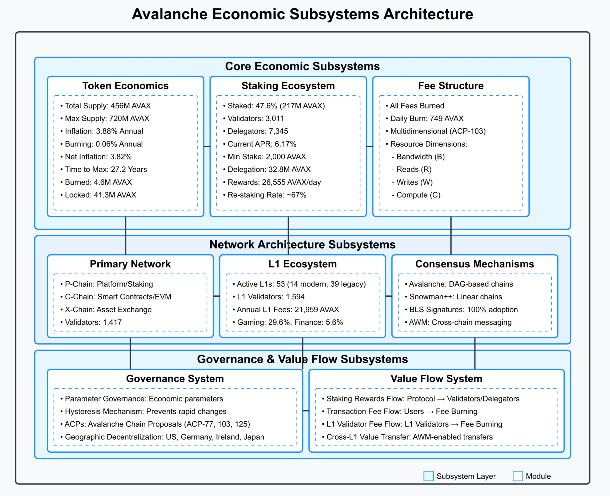

**Last Updated:** November 28, 2025
**Draft Stage:** 3rd Draft

# Avalanche Economic Model: A Systems Engineering Perspective

This document provides the conceptual foundations for understanding Avalanche as a complex adaptive economic system. It introduces model-based systems engineering (MBSE) principles, explains why traditional economic analyses fall short for blockchain networks, and demonstrates how systems thinking reveals emergent behaviors invisible to isolated mechanism analysis.

For the technical specifications and mathematical modeling, see [Subsystem Analysis and MultiGraph](/milestone2/Subsystem_Analysis_and_MultiGraph). For formal differential equations governing system dynamics, see [Differential Specification](/milestone3/Differential_Specification). For foundational concepts, see [Economic Taxonomy](/milestone1/Economic-Taxonomy) and [Mechanism Taxonomy](/milestone1/Mechanism-Taxonomy). Current metrics are sourced from the [Data Snapshot](/data/snapshot-2025-11-28).

---

## Table of Contents

- [Executive Summary](#executive-summary)
- [1. Why Model-Based Systems Engineering?](#1-why-model-based-systems-engineering)
- [2. The Five Pillars: Conceptual Framework](#2-the-five-pillars-conceptual-framework)
- [3. Beyond Mechanism Design: The Multigraph Agent Model](#3-beyond-mechanism-design-the-multigraph-agent-model)
- [4. Model Applications and Economic Hypotheses](#4-model-applications-and-economic-hypotheses)
- [5. Systems Thinking as Competitive Advantage](#5-systems-thinking-as-competitive-advantage)
- [References](#references)

---

## Executive Summary

The Avalanche network represents a **complex adaptive system** where technical and economic components influence each other continuously. Its unique architecture—a Primary Network with application-specific Layer 1 blockchains (L1s)—creates distinct economic challenges and opportunities that require a systems-level understanding to navigate effectively.

This document analyzes Avalanche using **model-based systems engineering (MBSE)** principles, providing the conceptual framework that underlies the technical specifications in the companion [Subsystem Analysis](/milestone2/Subsystem_Analysis_and_MultiGraph) document. We introduce a five-pillar decomposition of Avalanche economics and a **multigraph state-space model** that captures how participants engage with the system in multiple roles simultaneously.

| Analytical Framework | Purpose | Key Insight |
|---------------------|---------|-------------|
| Five-Pillar Decomposition | Understand subsystem boundaries | Economic behavior emerges from subsystem interactions |
| Multigraph Agent Model | Capture multi-role participation | Strategic decisions span role boundaries |
| Feedback Loop Analysis | Identify self-reinforcing dynamics | Predict emergent equilibria and instabilities |
| Control Theory Application | Design adaptive mechanisms | Dynamic fees as feedback controllers |

This systems approach reveals economic patterns and incentive structures not visible when viewing each mechanism in isolation—ultimately supporting more effective governance, mechanism design, and protocol evolution.

---

## 1. Why Model-Based Systems Engineering?

### 1.1 The Limitations of Traditional Economic Analysis

Traditional economic analyses of blockchain protocols typically examine mechanisms in isolation: staking economics analyzed separately from fee dynamics, token supply modeled independently of governance constraints. This siloed approach, while useful for initial understanding, creates significant blind spots when analyzing real-world blockchain economies.

**Why isolation fails for blockchain systems:**

- **Cross-domain dependencies**: When Avalanche introduced dynamic fees via [ACP-103](/milestone2/ACP-Summaries#acp-103), the change affected not only transaction costs but also burn rates, which influenced token scarcity, which impacted staking incentives. These cascading effects cannot be predicted without modeling subsystem interactions.

- **Multi-role participation**: Real participants don't occupy single roles. A validator who also operates an L1 chain, participates in governance, and trades tokens makes fundamentally different decisions than a pure validator. These cross-role strategies create emergent behaviors invisible to single-role models.

- **Feedback loops**: Blockchain economies contain multiple feedback mechanisms—positive loops that can amplify perturbations and negative loops that provide stability. Without explicit feedback modeling, protocol changes can have unintended consequences.

### 1.2 The MBSE Approach

Model-based systems engineering (MBSE) is a formalized methodology used to support the design, analysis, and validation of complex systems. As Shevchenko notes, MBSE creates "a common, unambiguous basis" for understanding how system components interact.

For Avalanche, MBSE provides several critical capabilities:

| Capability | Description | Example Application |
|------------|-------------|---------------------|
| **Decomposition** | Breaking complex systems into manageable subsystems | Five-pillar economic model |
| **Interface Definition** | Explicitly modeling connections between subsystems | Staking ↔ Supply coupling |
| **Emergent Property Identification** | Discovering behaviors arising from interactions | Self-regulating fee equilibria |
| **Scenario Analysis** | Testing "what-if" questions systematically | Impact of halving base fees |

### 1.3 Core Economic Principles of Avalanche

Before diving into systems analysis, we establish the foundational economic principles that differentiate Avalanche from other blockchain networks. These are detailed in [Economic Taxonomy](/milestone1/Economic-Taxonomy); here we highlight their systems significance:

**Capped Supply with Variable Issuance**: Unlike fixed-schedule issuance models, Avalanche incorporates governance-adjustable parameters that can modify emission rates. This creates a system with both fixed constraints (720M hard cap) and adaptive mechanisms (adjustable reward rates)—a classic control systems design pattern.

**Deflationary Fee Burning**: All transaction fees are burned rather than redistributed. This creates a direct feedback loop between network usage and token scarcity—higher activity increases burning, reducing circulating supply, potentially increasing token value, which may attract more users. This positive feedback loop requires careful monitoring.

**Continuous Fee Model for L1s**: Following [ACP-77](/milestone2/ACP-Summaries#acp-77), L1 validators pay ongoing fees (~1.33 AVAX/month) rather than large upfront stakes. This shift from stock-based to flow-based costs fundamentally changed the dynamics of L1 ecosystem growth and represents a significant systems redesign activated in December 2024.

**Governance Hysteresis**: Parameter changes include built-in stability mechanisms that prevent rapid oscillations—a design principle borrowed directly from control systems engineering where hysteresis prevents thrashing in feedback systems.

---

## 2. The Five Pillars: Conceptual Framework

Systems engineering teaches us that complex systems are best understood by decomposing them into manageable subsystems while carefully analyzing the interfaces between components. For Avalanche, we identify **five critical subsystems** that together form its economic foundation.

*Figure: The five-pillar architecture showing primary interaction pathways between subsystems.*

### 2.1 Staking Dynamics: The Security Foundation

The staking subsystem forms the backbone of Avalanche's security model. It encompasses all mechanisms related to token staking, delegation, and reward distribution—creating the economic incentives that make attacking the network prohibitively expensive.

**Systems Significance:**

The staking reward function incorporates both global network parameters and individual staking choices, creating a **complex adaptive system** where changes in one component ripple throughout the network. Individual decisions aggregate to influence network-wide economic conditions, which in turn affect future individual decisions—a classic feedback loop.

As of November 2025, approximately **248 million AVAX (~58% of circulating supply)** is staked across the network. This staking ratio represents an **equilibrium point** where the incentives for staking versus using tokens for transactions or other purposes have balanced out. The mathematical formalization of how this equilibrium emerges is detailed in [Differential Specification](/milestone3/Differential_Specification).

**Key Insight**: The staking system exhibits **homeostatic behavior**—when staking ratio drops, APR effectively increases (fewer stakers share the reward pool), attracting more stake; when staking ratio rises, APR decreases, making alternative uses more attractive. This self-regulating mechanism maintains security without requiring constant governance intervention.

### 2.2 Token Supply: Inflation-Deflation Dynamics

The token supply subsystem governs the creation, destruction, and circulation of AVAX tokens throughout the ecosystem. It embodies the fundamental tension between **inflation** (the cost of security through staking rewards) and **deflation** (the value captured through fee burning).

**Systems Significance:**

The supply subsystem demonstrates **control theory principles**. The system must balance between:
- Sufficient inflation to reward security providers
- Adequate deflation to maintain token value for holders

As of November 2025:
- **Total Supply**: ~460.6 million AVAX (64% of maximum)
- **Daily Emission**: ~49,000 AVAX through staking rewards
- **Daily Burn**: ~1,500 AVAX through fees (3× increase during 2025)
- **Net Daily Inflation**: ~47,500 AVAX

The burn rate acceleration during 2025 illustrates a positive feedback loop: increased network activity generates more fees, which increases burning, which may increase token scarcity and value, potentially attracting more activity. Whether this loop is stable or destabilizing depends on the elasticity of user demand with respect to token price—a question the [Economic Hypotheses](/milestone4/economic_hypotheses) framework addresses.

### 2.3 Fee Dynamics: The Congestion Controller

The fee dynamics subsystem governs how users pay for network resources and how these payments affect the broader economy. This subsystem explicitly applies **control systems engineering** to blockchain resource allocation.

**Systems Significance:**

Avalanche's fee mechanism employs an **exponential controller** that adjusts prices based on network congestion:

- When network usage exceeds target capacity, fees increase exponentially, quickly pricing out lower-value transactions
- When usage falls below capacity, fees decrease gradually, making the network more accessible

This approach, formalized in [ACP-103](/milestone2/ACP-Summaries#acp-103) and enhanced by [ACP-176](/milestone2/ACP-Summaries#acp-176), recognizes that blockchain networks require **proportional feedback mechanisms**. A fixed fee would be either too high during low demand (reducing accessibility) or too low during high demand (causing congestion).

The multidimensional nature of fees—accounting for bandwidth, storage reads, storage writes, and compute separately—reflects systems engineering's principle of **accurate metering**. Complex resources require nuanced allocation mechanisms.

**Post-Etna Evolution**: The C-Chain minimum base fee was reduced 96% (25 nAVAX → 1 nAVAX) via [ACP-125](/milestone2/ACP-Summaries#acp-125), allowing more accurate price discovery during low-demand periods. This represents a recalibration of the controller's operating range.

### 2.4 L1 Ecosystem: Modular Architecture

Avalanche's multi-chain architecture creates a distinct economic subsystem around Layer 1 blockchains that leverage the Primary Network's security. This subsystem demonstrates how **modular design principles** from systems engineering apply to blockchain architecture.

**Systems Significance:**

By separating application-specific chains from the security layer, Avalanche achieves both specialization and scale. This **separation of concerns** allows each L1 to optimize for its specific use case while leveraging shared security infrastructure.

The December 2024 activation of [ACP-77](/milestone2/ACP-Summaries#acp-77) fundamentally restructured L1 economics:

| Aspect | Legacy Model | Modern Model |
|--------|--------------|--------------|
| Entry Cost | 2,000 AVAX stake (~$70,000) | ~1.33 AVAX/month (~$53) |
| Primary Network | Must validate | Optional |
| Validator Management | Protocol-defined | Smart contract-based |
| Economic Independence | Partial | Full sovereignty |

As of November 2025, 53 L1s are active (14 using modern architecture, 39 legacy). The sector diversification—gaming (35%+), healthcare, metaverse, finance, AI—demonstrates **market-driven specialization** emerging from the modular architecture.

**Key Insight**: The transition from stock-based costs (upfront stake) to flow-based costs (continuous fees) represents a fundamental shift in system dynamics. Growth in L1 ecosystem now creates ongoing burn revenue rather than locked capital, changing the relationship between L1 adoption and Primary Network economics.

### 2.5 Governance: The Adaptation Mechanism

The governance subsystem enables Avalanche to adapt and evolve while maintaining stability. It exemplifies how systems thinking can be applied to organizational structures in blockchain networks.

**Systems Significance:**

Rather than viewing governance as separate from the technical protocol, Avalanche integrates governance capabilities directly into system design. This creates a **self-modifying system** capable of adaptation without destabilization—a key characteristic of resilient complex systems.

The **hysteresis mechanism** deserves special attention from a systems perspective:
- Once a parameter changes, it becomes increasingly difficult to modify by large amounts quickly
- This difficulty decreases gradually over time
- The mechanism prevents the governance equivalent of "thrashing" in computer systems

This approach, borrowed from control systems engineering, provides the **adaptation mechanisms** necessary for long-term sustainability in a changing environment.

### 2.6 Subsystem Interactions and Emergent Properties

The true power of systems engineering emerges not in analyzing individual components but in understanding their **interactions**. In Avalanche, several critical interaction points create network-wide behaviors:

**Staking-Supply Feedback Loop**: Staking rewards increase token supply, while the percentage of tokens staked affects reward rates. This creates dynamic equilibrium between inflation and security. The current ~58% staking ratio represents a stabilization point in this feedback system.

**Fee-Supply Balance**: Fee burning reduces supply, creating deflationary pressure that increases with network usage. This counterbalances inflationary pressure from staking rewards, with the balance point determining net monetary policy.

**L1-Validator Economics (Post-Etna)**: The decoupling of L1 validation from Primary Network validation changed the relationship between L1 growth and network security. L1 validators now contribute to burn revenue rather than stake pool.

**Governance-Parameter Coupling**: Changes to one parameter often necessitate adjustments to others, requiring holistic governance decisions that consider system-wide impacts.

These interactions create **emergent properties** not visible when examining each subsystem in isolation:

| Emergent Property | Description |
|-------------------|-------------|
| **Economic Equilibria** | The system naturally tends toward specific equilibrium states where staking participation, fee levels, and L1 adoption balance each other |
| **Self-Regulation** | Price mechanisms and incentive structures enable the network to self-regulate in response to changing conditions |
| **Parameter Sensitivity** | Certain parameters have outsized influence on system behavior, creating leverage points for governance |

---

## 3. Beyond Mechanism Design: The Multigraph Agent Model

While subsystem analysis provides valuable insights into Avalanche's economic structure, it still treats participants as idealized actors within separate mechanisms. In reality, participants engage with **multiple aspects of the system simultaneously**, creating complex behavioral patterns that require a more sophisticated modeling approach.

### 3.1 The Limitations of Single-Role Models

Traditional blockchain economic models operate under restrictive assumptions:
- Participants act within a **single role** (validator OR delegator OR user)
- Decisions in one role have no influence on decisions in another
- Participants possess **perfect information** about the system
- Decision-making is strictly **rational**

These simplifications, while useful for initial analysis, create significant blind spots. The reality of blockchain participation is far more nuanced:

A single entity in the Avalanche ecosystem frequently occupies multiple roles simultaneously—validating on the Primary Network, operating an L1 chain, participating in governance proposals, and strategically trading tokens based on market conditions. These overlapping responsibilities create decision frameworks where actions in one domain necessarily influence strategies in others.

**Example**: A validator who also operates an L1 chain might:
- Accept lower delegation fees to attract more stake (validator decision)
- Which provides more governance voting weight (governance implication)
- Which can influence proposals affecting their L1's economics (cross-role strategic benefit)

### 3.2 The Multigraph State-Space Model

To address these limitations, we employ a **Multigraph State-Space Model (MSSM)** that explicitly represents the multifaceted nature of blockchain participation. The technical implementation is detailed in [Subsystem Analysis](/milestone2/Subsystem_Analysis_and_MultiGraph); here we focus on the conceptual framework.

*Figure: The Multigraph Agent Model showing how a single agent can simultaneously participate in multiple network roles.*

**Key Innovations of the MSSM:**

| Feature | Description | Why It Matters |
|---------|-------------|----------------|
| **Multi-Role Agents** | Agents can simultaneously occupy multiple positions | Captures real-world participation patterns |
| **Role-Specific States** | Distinct state variables for each role occupied | Enables role-by-role optimization analysis |
| **Cross-Role Integration** | Decisions in one role influence others | Models strategic dependencies and synergies |
| **Interaction Networks** | Multidimensional relationships between agents | Reveals coalition formation and influence patterns |

### 3.3 Agent Behavior and Emergent Phenomena

The MSSM reveals sophisticated behavioral patterns invisible to single-role analysis:

**Validator-Traders**: May strategically time token sales to coincide with reward distributions, leveraging information about reward timing.

**Delegator-Governance Participants**: May vote in alignment with their chosen validators, creating voting blocs that amplify the influence of popular validators.

**L1 Validators**: Balance resources between Primary Network validation (if applicable) and L1-specific responsibilities, navigating complex tradeoffs between security contributions and application development.

These integrated strategies give rise to **emergent phenomena** with profound implications:

| Phenomenon | Description | Implication |
|------------|-------------|-------------|
| **Stake Concentration Cycles** | Successful validators attract more delegation → gain governance influence → potentially steer decisions to benefit large validators | May require governance countermeasures |
| **Cross-Role Arbitrage** | Agents exploit information asymmetries between roles (e.g., L1 knowledge → trading advantage) | Creates MEV-like dynamics |
| **Coalition Formation** | Agents with complementary roles form alliances, coordinating across staking, governance, and L1 operations | Amplifies certain stakeholder voices |

### 3.4 Modeling Multi-Role Strategy

The MSSM represents each agent with:

1. **Token Holdings**: Balance state across chains
2. **Role Assignments**: Set of active roles (validator, delegator, L1 operator, governance participant, trader)
3. **Strategy Functions**: Decision-making processes for each role
4. **Interaction History**: Past actions that influence future decisions

The multigraph structure captures three types of relationships:
- **Agent-Role Edges**: Connect agents to their assigned roles
- **Agent-Agent Edges**: Direct relationships (delegation, transactions)
- **Role-Mediated Edges**: Indirect relationships through shared roles

This framework enables analysis of strategic behaviors that span role boundaries, providing insights for both mechanism design and governance.

---

## 4. Model Applications and Economic Hypotheses

The systems engineering approach—combining subsystem decomposition with multigraph agent modeling—provides powerful tools for optimizing Avalanche's economic design.

### 4.1 Practical Applications

**Governance Impact Analysis**: Before implementing parameter changes through ACPs, governance can model cascading effects across subsystems. For example, reducing base fees ([ACP-125](/milestone2/ACP-Summaries#acp-125)) affects:
- Immediate: Transaction costs ↓
- Secondary: Burn rate changes
- Tertiary: Net inflation adjustment
- Quaternary: Staking incentive implications

**Incentive Misalignment Detection**: The MSSM identifies where multi-role participants might have incentives that conflict with protocol goals. These insights inform mechanism redesigns.

**Economic Hypothesis Testing**: The [Economic Hypotheses](/milestone4/economic_hypotheses) framework uses these models to test specific claims about Avalanche economics:

| Hypothesis Category | Example Question | Modeling Approach |
|--------------------|------------------|-------------------|
| Fee Burning Dynamics | Do higher burn rates create self-reinforcing adoption cycles? | Feedback loop analysis |
| Staking-Utility Balance | What staking ratio optimizes security vs. liquidity? | Equilibrium modeling |
| L1 Sustainability | Does continuous fee model provide adequate burn revenue? | Flow analysis |
| Dynamic Fee Optimization | Do multidimensional fees accurately price resources? | Control theory validation |

### 4.2 Methodological Foundation

The systems models support multiple analytical approaches:

- **System Dynamics Modeling**: Stock-flow diagrams capturing subsystem state evolution
- **Agent-Based Simulation**: Computational models of multi-role agent populations
- **Empirical Validation**: Comparing model predictions against on-chain data
- **Sensitivity Analysis**: Identifying high-leverage parameters for governance attention
- **Scenario Planning**: Exploring "what-if" questions about protocol changes

The mathematical formalization is provided in [Differential Specification](/milestone3/Differential_Specification).

---

## 5. Systems Thinking as Competitive Advantage

Avalanche's economic model represents a significant advancement in blockchain design, incorporating sophisticated mechanisms across multiple interconnected subsystems. By applying MBSE principles to understand and evolve this system, the Avalanche community gains several strategic advantages:

### 5.1 Reduced Unintended Consequences

Systems thinking helps identify potential issues before they manifest in production. By modeling subsystem interactions, governance can anticipate cascading effects and design changes that achieve intended outcomes without disrupting other system components.

The governance history illustrates this value: Major upgrades like Etna (December 2024), Octane (April 2025), and Granite (November 2025) bundled multiple ACPs together because their interactions had been modeled as a system rather than isolated changes.

### 5.2 Enhanced Adaptability

A modular design with well-understood interfaces makes it easier to evolve individual components without destabilizing the whole system. The five-pillar decomposition provides clear boundaries for innovation:

- L1 ecosystem changes don't require Primary Network modifications
- Fee mechanism adjustments don't alter staking reward formulas
- Governance can tune parameters within defined safe ranges

### 5.3 Improved Governance

Decision-makers equipped with systems models can make more informed choices about parameter adjustments and protocol upgrades. The MSSM particularly helps governance by:

- Revealing where multi-role participants might have concentrated influence
- Identifying parameters with outsized system-wide effects
- Predicting equilibrium shifts from proposed changes

### 5.4 Stakeholder Alignment

A shared systems model helps align diverse stakeholders around common understanding of how the network functions. When validators, L1 operators, delegators, and governance participants share a mental model of system dynamics, coordination becomes more efficient and conflicts more tractable.

### 5.5 The Path Forward

The complex nature of blockchain economies demands sophisticated modeling approaches. By embracing MBSE and multigraph agent modeling, Avalanche positions itself at the forefront of economic design in the blockchain space—creating a foundation for sustainable growth and adaptation in an ever-changing technological and regulatory landscape.

The tools developed in this research program—subsystem specification maps, multigraph models, differential equations, and hypothesis testing frameworks—provide the analytical infrastructure for evidence-based protocol evolution.

---

## References

1. Shevchenko, N. (2020). *Introduction to Model Based Systems Engineering*. Software Engineering Institute, Carnegie Mellon University. https://insights.sei.cmu.edu/blog/introduction-model-based-systems-engineering-mbse

2. Buterin, V. et al. (2022). *Ethereum 2.0 Specification*. Ethereum Foundation. https://ethereum.org/en/eth2/

3. Avalanche Foundation. (2023-2025). *Avalanche Community Proposals (ACPs)*. GitHub. https://github.com/avalanche-foundation/ACPs

4. Ava Labs. (2020). *Avalanche Platform Whitepaper*. https://www.avalabs.org/whitepapers

5. Ava Labs. (2020). *Avalanche Consensus Protocol Whitepaper*. https://www.avalabs.org/whitepapers

6. Zargham, M., & Ben-Meir, I. (2023). *Block by Block: Managing Complexity with Model-Based Systems Engineering*. BlockScience Blog. https://blog.block.science/block-by-block-managing-complexity-with-model-based-systems-engineering/

7. Avalanche. (2025). *Etna Upgrade Documentation*. Avalanche Builder Hub. https://build.avax.network/docs/upgrades/etna

8. Avalanche. (2025). *Granite Upgrade*. Avalanche Builder Hub. https://build.avax.network/blog/granite-upgrade

9. Lewis-Pye, A. et al. (2024). *Frosty: Bringing Strong Liveness Guarantees to the Snow Family*. https://arxiv.org/abs/2404.14250

10. Avalanche Foundation. (2024). *ACP-77: Reinventing Subnets*. https://github.com/avalanche-foundation/ACPs/tree/main/ACPs/77-reinventing-subnets

11. Avalanche Foundation. (2024). *ACP-103: Dynamic Fees for P-Chain and X-Chain*. https://github.com/avalanche-foundation/ACPs/tree/main/ACPs/103-dynamic-fees

12. Avalanche Foundation. (2024). *ACP-176: Dynamic EVM Gas Limits*. https://github.com/avalanche-foundation/ACPs/tree/main/ACPs/176-dynamic-evm-gas-limit-and-price-discovery-updates
