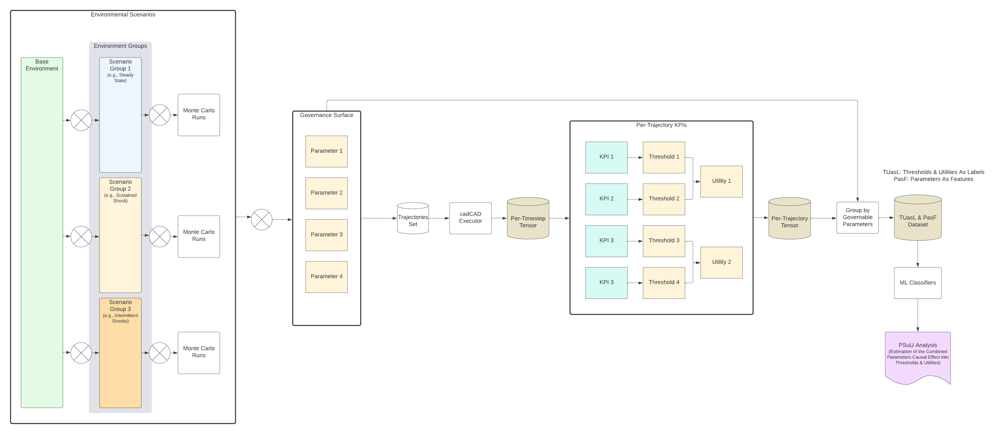
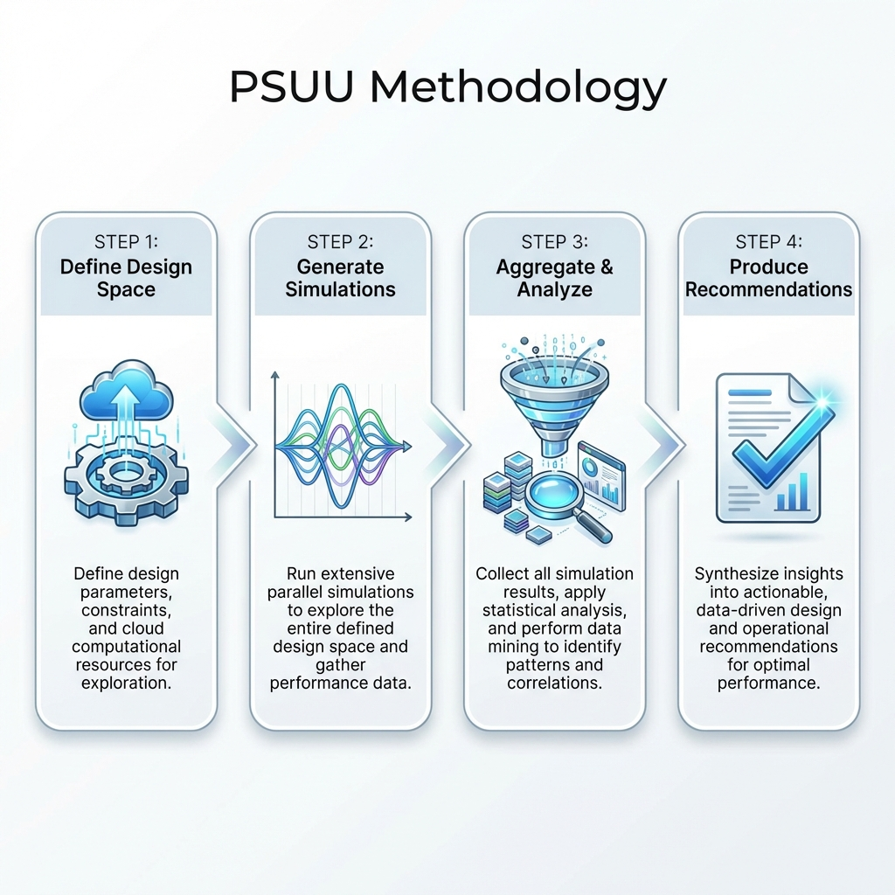
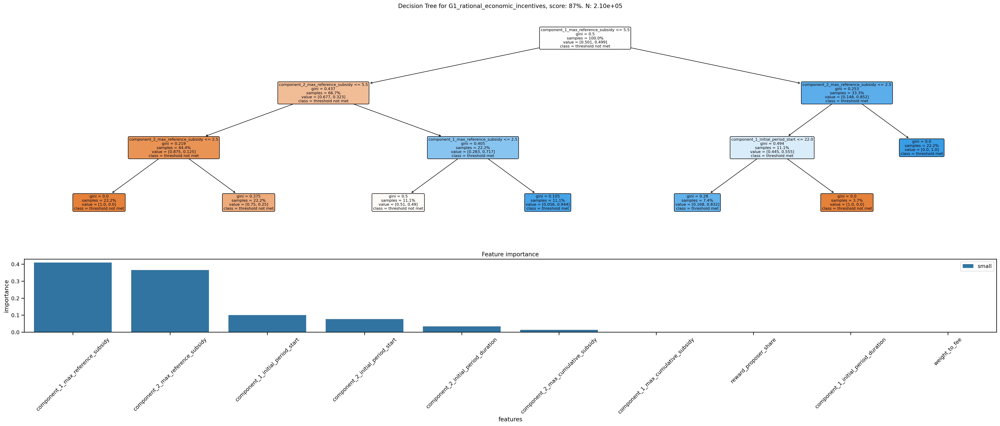
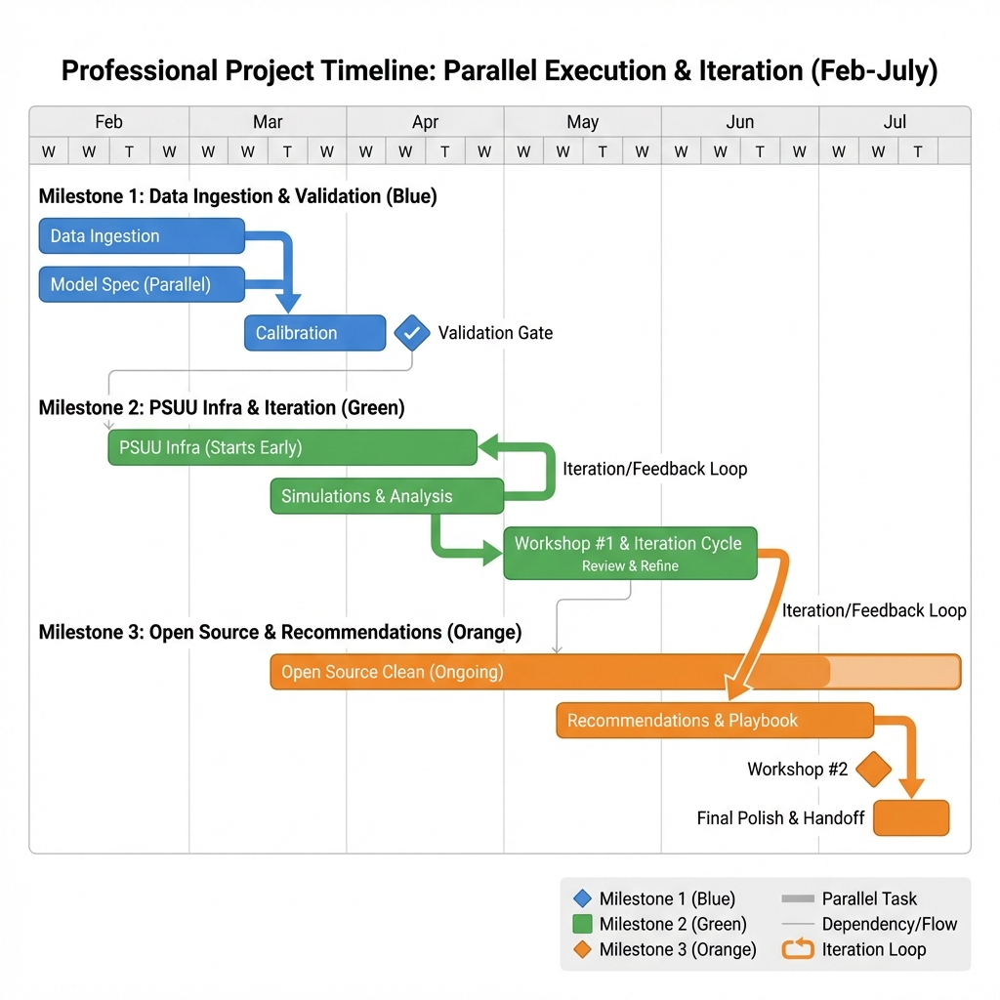

# Avalanche Staking Economics: Phase II Proposal

**Project:** Parameter Selection Under Uncertainty for Avalanche Staking

**Team:** Bonding Curve Research Group (BCRG)

**Amount:** $150,000

**Duration:** 6 Months

**Date:** February 4, 2026

**Version:** 2.2

---

## Executive Summary

Following the successful completion of [Phase I](https://bonding-curves.github.io/avalanche-research/)—which delivered foundational taxonomies, systems analysis, and a comprehensive differential specification—this proposal outlines **Phase II**: a focused investigation of the Avalanche staking subsystem using the Parameter Selection Under Uncertainty (PSUU) methodology.

**Phase II** will produce **validated, actionable parameter recommendations** specifically for the staking subsystem, enabling the Avalanche Foundation to make data-driven decisions about validator rewards, staking duration, and yield structures.

Staking economics represents a top priority for the Foundation, with multiple community-initiated ACPs addressing validator and delegation mechanisms. This work delivers the analytical foundation for evidence-based governance decisions for staking, validating, and delegation mechanism parameterization for the Avalanche Network.

**Key deliverables:**

- Calibrated staking model validated against 2024-2025 historical data
- Sensitivity analysis revealing which governance levers most affect staking outcomes
- Parameter recommendation report with decision trees and correlation analysis
- Open source model and knowledge transfer workshops
- Analytic support for ACP development regarding staking incentives and parameterization

---

## Part I: Scope

### Focus: The Staking Subsystem

**Phase II** narrows scope to the staking subsystem specifically, abstracting away other components of the full differential specification. This focused model will capture:

- Validator staking behavior
- Delegator staking behavior
- Reward mechanics and yield determination
- Duration-dependent incentive structures

Other subsystems (L1 ecosystem dynamics, fee markets) are treated as environmental inputs rather than endogenous components.

### The Core Question

> Under what "governance" configurations do Avalanche's staking incentives sustain validator and delegator participation across bull markets, bear markets, and competing DeFi yields—while maintaining the security guarantees required by a multi-billion dollar network?

---

## Part II: Methodology

### Parameter Selection Under Uncertainty (PSUU)

PSUU is a computational methodology developed by complex systems engineering firm [Block Science](https://medium.com/block-science/how-to-perform-parameter-selection-under-uncertainty-976931ba7e5d) for selecting robust parameters when system behavior is uncertain. Successfully applied to [Subspace Network tokenomics](https://github.com/BlockScience/subspace), it systematically explores the relationship between governance decisions and system outcomes.

*Fig 1: The PSUU pipeline—from environmental scenarios through simulation to ML-based parameter recommendations*

### How PSUU Works

*Fig 2: The 4-step PSUU process flow*

**Step 1: Define the Design Space**

- Identify controllable parameters (governance levers)
- Identify environmental scenarios (external uncertainty)
- Define KPIs and success thresholds

**Step 2: Generate Simulations**

- Cartesian product of all parameter combinations
- Multiple Monte Carlo runs per combination
- Result: thousands of simulation trajectories

**Step 3: Aggregate and Analyze**

- Compute KPIs for each trajectory
- Convert KPIs to binary utility outcomes (threshold met / not met)
- Apply machine learning to identify parameter-outcome relationships

**Step 4: Produce Recommendations**

- Decision trees showing parameter importance
- Correlation matrices linking levers to outcomes
- Parameter ranges optimized for single or multiple goals

### Example Output: Decision Tree

*Fig 3: Decision tree for goal optimization, with feature importance analysis*

### Example Output: Parameter Influence

*Fig 4: Parameter influence on KPIs across simulation results*

---

## Part III: The Design Space—Parameters and Mechanisms

> The following represents an illustrative design space based on preliminary discussions. The actual design space, including specific parameters, ranges, scenarios, and KPIs, will be discovered collaboratively between BCRG and the Avalanche team and validated against real data during **Milestone 1**.

### Controllable Parameters (Governance Surface)

These are policy levers the Avalanche Foundation can adjust. The current reward function is defined as:

$$
Reward = (R_{max} - R_{current}) \times \frac{S_{total}}{S_{supply}} \times \frac{t_{stake}}{t_{year}} \times C(t_{stake})
$$

Where $C(t_{stake})$ is the consumption rate function governed by the parameters below, typically modeled as a linear interpolation between minimum and maximum yield bounds:

$$
C(t_{stake}) = Y_{min} + (Y_{max} - Y_{min}) \times \left( \frac{t_{stake} - t_{min}}{t_{max} - t_{min}} \right)
$$

| Parameter | Description | Current | Exploration Range |
|-----------|-------------|---------|-------------------|
| `MIN_STAKE_DURATION` | Minimum lockup period | 2 weeks | 1 week – 3 months |
| `MAX_STAKE_DURATION` | Maximum lockup period | 1 year | 6 months – 2 years |
| `MIN_DURATION_YIELD` | APR for minimum duration | ~6% | 4% – 8% |
| `MAX_DURATION_YIELD` | APR for maximum duration | ~8% | 6% – 12% |
| `CONSUMPTION_RATE_BOUNDS` | Reward distribution parameters | Current | ±20% variations |
| `VALIDATOR_REWARD_SHARE` | Split between validators/delegators | Current | 60% – 90% |

### Mechanism Design Space

Beyond parameter sweeps on the existing reward function, Phase II accommodates exploration of **alternative mechanism designs**. The simulation framework is architected as a modular system where the reward function is a pluggable component—enabling systematic evaluation of fundamentally different incentive structures against the same KPIs and environmental scenarios.

**Why this matters:** The Avalanche Foundation is actively collaborating with external teams on mechanism ideation—surveying possibilities like node-age-weighted rewards, activity-based multipliers, or duration curve alternatives. BCRG's contribution complements this ideation work by providing the analytical engine to *evaluate* proposed mechanisms, rather than generating designs independently.

**Framework capabilities:**

| Capability | Description |
|------------|-------------|
| **Pluggable reward functions** | Swap alternative reward formulas (linear, piecewise, state-dependent) without model restructuring |
| **Mechanism comparison** | Test multiple reward structures against identical scenarios and KPIs |
| **Collaborative iteration** | Rapidly incorporate mechanisms from external ideation into the simulation pipeline |
| **Case study methodology** | Prior engagements demonstrate this approach: evaluating multiple issuance functions, subsidy schedules, and fee distribution mechanisms within a unified analytical framework |

The design space tables below represent the *current protocol configuration*—the starting point for exploration. The framework supports extension to mechanisms that may not exist in the protocol today.

### Environmental Scenarios (External Uncertainty)

Conditions beyond the protocol's control that the system must be robust against:

| Scenario | Description | Values |
|----------|-------------|--------|
| `EXTERNAL_YIELD` | Competing DeFi/TradFi yields | 3%, 5%, 7%, 10% |
| `MARKET_CONDITION` | Crypto market sentiment | Bull, Neutral, Bear |
| `NETWORK_GROWTH` | L1 adoption rate | Low, Medium, High |

**Scenario Groups:**

- **Baseline:** Expected conditions over simulation horizon
- **Sustained Stress:** Prolonged adverse conditions (bear market, high competing yields)
- **Shock Events:** Temporary disruptions (market crash, yield spike)

### Behavioral Dynamics (Response Functions Calibrated from Data)

A key methodological advancement: behavioral parameters are modeled as **state variables that evolve endogenously**, not fixed constants.

**Core Behavioral Parameters:**

| Parameter | Value (Spec) | Phase I Concept | Phase II Treatment |
|-----------|--------------|-----------------|--------------------|
| `STAKING_SENSITIVITY` | 0.1 | Fixed Stake Rate | State Variable: f(APR differential) |
| `OPPORTUNITY_COST` | 5% | Fixed Unstake Rate | State Variable: f(External Yields) |
| `AVG_RESTAKE_RATE` | 67% | Fixed Restake Rate | State Variable: f(Compounding Incentive) |
| `COMMISSION_RATE` | 2-20% | N/A | Variable distribution parameter |

**Response Function Form:**

Staking flows respond to the spread between APR and Opportunity Cost.

> **Note:** The `tanh` function below is an illustrative *reference implementation* of bounded rationality. We are not biased toward this specific form; Phase II will empirically calibrate the optimal response function (e.g., logistic, piecewise linear) against historical data.

$$
flow = SENSITIVITY \times supply \times max(0, tanh(APR - OPPORTUNITY\_COST))
$$

**Calibration approach:**

1. Ingest Avalanche-provided historical data (2024-2025)
2. Fit the *response functions* (f) to observed stake/unstake patterns—these functions define how behavioral parameters evolve during simulation
3. Validate fitted functions against held-out data
4. Apply uncertainty bounds to function parameters for PSUU exploration

### Key Performance Indicators

Aligned with the **Differential Specification**, we categorize success metrics into Security, Economics, and Stability:

| Category | Indicator | Target Direction | Description |
|----------|-----------|------------------|-------------|
| **Security** | `STAKING_RATIO` | 50-60% | Optimal range for economic security vs. liquidity. |
| **Security** | `VALIDATOR_COUNT` | >1,000 | Maintaining sufficient decentralization. |
| **Security** | `DECENTRALIZATION` | High (1-HHI) | Preventing stake concentration. |
| **Economic** | `NET_INFLATION` | Decreasing | Path toward deflationary crossover (burn > issuance). |
| **Economic** | `VAL_PROFITABILITY` | >0 (Sustainable) | Rewards + Fees must cover operational costs. |
| **Stability** | `APR_VOLATILITY` | Low Variance | Preventing erratic yield fluctuations. |
| **Stability** | `STAKING_VOLATILITY` | Low Variance | Preventing rapid mass unstaking events. |

---

## Part IV: Model Validation

A critical methodological question: how do we evaluate whether the model matches reality?

### Goodness-of-Fit Protocol

**Approach:**

1. Initialize model with actual state variables from January 2025
2. Run simulation forward through December 2025
3. Compare simulated trajectories to observed historical values
4. Compute goodness-of-fit metrics

**Metrics:**

| Metric | Description | Target |
|--------|-------------|--------|
| Trajectory correlation | Pearson r between simulated and actual | > 0.90 |
| RMSE (staking ratio) | Root mean squared error | < 2 percentage points |
| Direction accuracy | % of time trends match | > 85% |
| **Duration matching** | Temporal dynamics alignment—model captures *when* state changes occur, not just final values | Phase alignment within ±7 days |
| Turning point detection | Captures major inflections | Qualitative assessment |

**If validation fails:** Iterate on behavioral parameter calibration until acceptable fit is achieved. This ensures the model's sensitivity analysis reflects reality, not artifacts.

---

## Part V: Milestones & Deliverables

### Milestone 1: Foundation (Months 1-2)

**Focus:** Data ingestion, model definition, behavioral calibration

**Deliverables:**

| ID | Deliverable | Description |
|----|-------------|-------------|
| 1.1 | Data Ingestion | Ingest Avalanche-provided historical data (validator/delegator flows, rewards, durations) |
| 1.2 | Data Manifest | Documentation of sources, transformations, quality metrics |
| 1.3 | Staking Model Spec | Simplified model focused on staking subsystem with behavioral state variables |
| 1.4 | Behavioral Calibration | Fitted response functions for stake/unstake/restake with confidence intervals |
| 1.5 | Preliminary Validation | Initial goodness-of-fit assessment against 2024-2025 data |

**Success Criterion:** Preliminary Validation Report delivered and approved by Avalanche team

**Budget:** $40,000

---

### Milestone 2: Simulation & Analysis (Months 3-4)

**Focus:** PSUU implementation, Monte Carlo sweeps, sensitivity analysis

**Deliverables:**

| ID | Deliverable | Description |
|----|-------------|-------------|
| 2.1 | PSUU Infrastructure | Full parameter sweep pipeline with cloud compute |
| 2.2 | Simulation Execution | 50,000+ trajectories across governance × environment space |
| 2.3 | KPI Computation | Automated computation of all KPIs per trajectory |
| 2.4 | Validation Confirmation | Final goodness-of-fit achieving >90% correlation |
| 2.5 | Sensitivity Analysis | Decision trees and correlation matrices for all KPIs |
| 2.6 | Risk Surface Map | Parameter regions where staking incentives fail |
| 2.7 | Workshop #1 | Model walkthrough and preliminary findings review |
| 2.8 | Collaborative Mechanism Design | Support for evaluating alternative reward mechanisms proposed by Avalanche or external teams |

**Deliverable 2.8 Detail:** The collaborative mechanism design deliverable provides a structured process for incorporating alternative reward function designs into the simulation framework. This includes: (1) a documented interface for specifying new reward mechanisms as pluggable components, (2) rapid turnaround on mechanism evaluation requests, and (3) comparative analysis positioning proposed mechanisms against baseline performance. This deliverable ensures BCRG's analytical work complements—rather than duplicates—the Foundation's parallel mechanism ideation efforts with external collaborators.

**Success Criterion:** Sensitivity Analysis Report delivered covering all key parameters

**Budget:** $60,000

---

### Milestone 3: Delivery & Transfer (Months 5-6)

**Focus:** Recommendations, documentation, knowledge transfer

**Deliverables:**

| ID | Deliverable | Description |
|----|-------------|-------------|
| 3.1 | Parameter Recommendation Report | Actionable guidance with decision framework |
| 3.2 | Scenario Playbook | "If X market condition, then Y parameter adjustment" |
| 3.3 | Open Source Release | Full model code with documentation |
| 3.4 | Workshop #2 | How to run scenarios and interpret results |

**Success Criterion:** Final Parameter Report delivered and Code Repository transferred

**Budget:** $50,000

---

## Part VI: Budget Summary

| Category | Item | Amount |
|----------|------|--------|
| **Milestone 1** | Foundation | $40,000 |
| **Milestone 2** | Simulation & Analysis | $60,000 |
| **Milestone 3** | Delivery & Transfer | $50,000 |
| **TOTAL** | | **$150,000** |

### Budget Breakdown by Function

| Function | Amount | Notes |
|----------|--------|-------|
| Principal Researcher | $90,000 | Model architecture, analysis, synthesis |
| Data Engineering | $38,000 | Data pipeline, simulation infrastructure |
| Compute | $2,000 | Cloud resources for Monte Carlo sweeps |
| Operations | $10,000 | Coordination, documentation, workshops |
| Buffer | $10,000 | Unforeseen complexity |

The lower cost reflects focused scope and existing Phase I infrastructure.

---

## Part VII: Timeline

*Fig 5: 6-Month Project Timeline detailing parallel work streams and iteration cycles*

---

## Part VIII: Team

| Role | Name | Responsibility |
|------|------|----------------|
| Project Lead | Hash Nabir | Stakeholder coordination, milestone management |
| Principal Researcher | Shawn Anderson | Model architecture, PSUU implementation, analysis |
| Data Engineer | Rex | Data analysis, simulation infrastructure |
| Domain Advisor | Jeff Emmett | Token economics, mechanism design, model review |
| Operations Support | Jessica Zartler | Coordination, documentation, publishing |

---

## Part IX: Success Criteria

| Criterion | Measurement | Target |
|-----------|-------------|--------|
| Model validity | Goodness-of-fit vs. historical data | >90% correlation |
| Analysis coverage | KPIs with significant sensitivity results | All defined KPIs |
| Recommendation clarity | Actionable parameter ranges delivered | Yes |
| Knowledge transfer | Avalanche team can run scenarios independently | Verified in workshop |
| Code quality | Open source, documented, reproducible | GitHub release |

---

## Appendix A: Phase III Horizon

Beyond Phase II, opportunities exist for continued collaboration:

- **ACP Advisory:** Support community proposal development with simulation-backed analysis
- **Ongoing Monitoring:** Periodic model updates as network evolves
- **Extended Scope:** Apply PSUU to other subsystems (fee markets, L1 incentives)

These possibilities can be scoped after Phase II completion based on Foundation priorities.

---

## Appendix B: Reference Materials

### Phase I Research (BCRG)

- [Avalanche Economic Research Portal](https://bonding-curves.github.io/avalanche-research/) — Foundational taxonomies, systems analysis, and ACP summaries
- [Differential Specification](https://bonding-curves.github.io/avalanche-research/milestone3/Differential_Specification) — Mathematical model of Avalanche's economic subsystems using control theory

### PSUU Methodology (Block Science)

- [How to Perform Parameter Selection Under Uncertainty](https://medium.com/block-science/how-to-perform-parameter-selection-under-uncertainty-976931ba7e5d) — Methodological foundation for the PSUU approach
- [PSUU Work Plan Methodology](https://github.com/BlockScience/subspace/blob/main/resources/subspace-psuu-work-plan-methodology.md) — Detailed workflow documentation including KPI definitions, scenario groups, and trajectory tensor structures
- [Parameter Selection Report](https://github.com/BlockScience/subspace/blob/main/resources/subspace-parameter-selection-report.md) — Example deliverable showing correlation analysis and parameter recommendation tiers

### Related Work

- Block Science. (2024). [Subspace Digital Twin Repository](https://github.com/BlockScience/subspace) — Reference implementation of PSUU for staking economics
- Voshmgir, S. & Zargham, M. (2020). [Foundations of Cryptoeconomic Systems](https://epub.wu.ac.at/7309/) — Theoretical grounding for token system analysis

---

*Proposal prepared by Bonding Curve Research Group*

*February 4, 2026*
