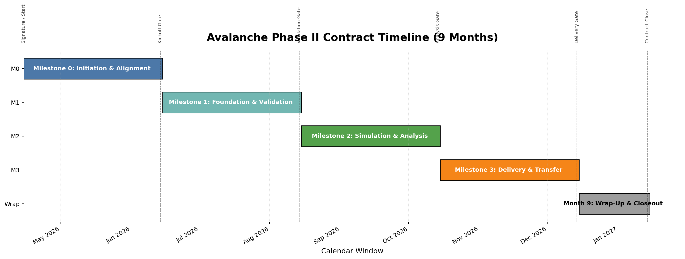

# Avalanche Staking Economics: Phase II Proposal

**Project:** Parameter Selection Under Uncertainty for Avalanche Staking

**Team:** Bonding Curve Research Group (BCRG)

**Amount:** $100,000

**Duration:** 9 Months (8 months active delivery + 1 month wrap-up buffer)

**Date:** April 16, 2026

**Version:** 2.5

---

> **Version note:** v2.5 updates v2.4 (April 8, 2026) to align the proposal with the currently discussed contracting cadence: a 9-month contract window from signature, structured as four 2-month delivery blocks followed by a 1-month wrap-up and buffer period. The grant remains $100,000, handled administratively as four equal installments of $25,000. Scope remains focused on Avalanche staking economics, but the delivery window now explicitly includes time for review cycles, iteration, knowledge transfer, communications, and administrative closeout.

---

## Executive Summary

Following the successful completion of [[About-The-BCRG|Phase I]]—which delivered [[Participant-Roles-Taxonomy|participant role taxonomies]], [[Economic-Taxonomy|economic taxonomies]], [[Mechanism-Taxonomy|mechanism taxonomies]], [[Avalanche-Economic-Model-A-Systems-Engineering-Perspective|systems engineering analysis]], and a comprehensive [[Differential_Specification|differential specification]]—this proposal outlines **Phase II**: a focused investigation of the Avalanche staking subsystem using the Parameter Selection Under Uncertainty (PSUU) methodology.

**Phase II** will produce **validated, actionable parameter recommendations** specifically for the staking subsystem, enabling the Avalanche Foundation to make data-driven decisions about validator rewards, staking duration, and yield structures.

Staking economics is a top priority for the Foundation. Multiple community-initiated [[ACP-Summaries|ACPs]] already address validator and delegation mechanisms, signaling both urgency and opportunity. This work delivers the analytical foundation those governance decisions require.

The proposed delivery cadence is intentionally structured for practical adoption, not just analysis. The contract window provides room for model development, simulation, collaborative review, mechanism iteration, documentation, training, and final handoff so that outputs are operationally useful to the Avalanche team.

**Key deliverables:**

- **Flexible simulation framework** with pluggable reward mechanisms for evaluating alternative designs
- Calibrated staking model validated against 2024-2025 historical data
- Sensitivity analysis revealing which governance levers most affect staking outcomes
- **Collaborative mechanism design support** for rapid evaluation of reward function alternatives
- Parameter recommendation report with decision trees and correlation analysis
- Open source model and knowledge transfer workshops
- Analytic support for ACP development regarding staking incentives and parameterization

---

## Part I: Scope

### Focus: The Staking Subsystem

Phase II focuses on the staking subsystem, treating other components of the [[Differential_Specification|differential specification]] as environmental context. This narrower scope enables deeper analysis of the mechanisms that matter most:

- Validator staking behavior
- Delegator staking behavior
- Reward mechanics and yield determination
- Duration-dependent incentive structures

Other subsystems from the full differential specification—L1 ecosystem dynamics, fee markets, cross-chain flows—are treated as environmental inputs rather than endogenous components. This abstraction keeps the model tractable while preserving the dynamics most relevant to staking parameter decisions. Fee revenue and L1 adoption rates enter as scenario variables rather than simulated outcomes.

### The Core Question

> Under what "governance" configurations do Avalanche's staking incentives sustain validator and delegator participation across bull markets, bear markets, and competing DeFi yields—while maintaining the security guarantees required by a multi-billion dollar network?

---

## Part II: Methodology

### The Challenge: Selecting Parameters Under Uncertainty

Governance decisions about staking parameters—yield bounds, duration limits, validator shares—must account for conditions that cannot be known in advance. What external DeFi yields will look like in six months, whether the market will be bullish or bearish, how network adoption will evolve: these factors affect whether a given parameter configuration succeeds or fails, yet they lie outside the protocol's control.

Traditional parameter selection either ignores this uncertainty (picking values that work for one assumed future) or handles it informally (expert judgment). PSUU provides a systematic alternative: explore how parameter choices perform across *many* possible futures, then identify configurations that succeed robustly.

### Parameter Selection Under Uncertainty (PSUU)

PSUU, developed by [Block Science](https://medium.com/block-science/how-to-perform-parameter-selection-under-uncertainty-976931ba7e5d), is a computational methodology that maps the relationship between governance decisions and system outcomes across environmental scenarios. Successfully applied to [Subspace Network tokenomics](https://github.com/BlockScience/subspace), it produces actionable recommendations backed by simulation evidence.

*Fig 1: Complete PSUU data pipeline. Left: Environmental scenarios (Scenario Groups 1-3) combined with Monte Carlo runs. Center: Governance parameters feed into the cadCAD simulation executor, producing per-timestep trajectories. Right: KPIs are computed per trajectory, converted to binary utilities via thresholds, grouped by controllable parameters, and passed to ML classifiers for analysis. The output identifies which parameter configurations achieve goals across scenario conditions.*

### The Trajectory Tensor

The core data structure is a 4-dimensional tensor of simulation results:

$$
T[c, s, r, k] = \text{KPI } k \text{ under parameters } c\text{, scenario } s\text{, run } r
$$

The trajectory tensor is the central data structure of PSUU—it stores every simulation result indexed by four coordinates: parameter configuration (c), environmental scenario (s), Monte Carlo run (r), and KPI (k). This tensor is the complete record of how the system behaves across all combinations, and all subsequent analysis derives from it.

| Dimension | Symbol | Description | Example Size |
|-----------|--------|-------------|--------------|
| Controllable parameters | $c$ | Governance configurations | 500 combinations |
| Scenarios | $s$ | Environmental conditions | 20 scenarios |
| Monte Carlo runs | $r$ | Stochastic variation | 5 runs per combination |
| KPIs | $k$ | Success metrics | 7 indicators |

For Phase II, this yields approximately 50,000 trajectories (500 × 20 × 5), each producing 7 KPI measurements—350,000 data points mapping the governance-to-outcome relationship.

### How PSUU Works

*Fig 2: The four-step PSUU workflow. Step 1 defines controllable parameters, environmental scenarios, and cloud compute resources. Step 2 runs parallel simulations across the full design space. Step 3 aggregates results, applies statistical analysis, and identifies patterns through data mining. Step 4 synthesizes findings into actionable recommendations for governance decisions.*

**Step 1: Define the Design Space**

The design space bounds the analysis. This step specifies what can be controlled (governance parameters with exploration ranges), what cannot be controlled (environmental scenarios), and what constitutes success (KPIs with thresholds).

**Step 2: Generate Simulations**

Simulation generates the raw data for analysis. The calibrated model runs across the Cartesian product of parameter combinations and scenarios, with multiple Monte Carlo runs per combination to capture stochastic variation in behavioral responses.

**Step 3: Aggregate and Analyze**

Analysis transforms simulation data into actionable patterns. For each trajectory, compute KPIs and convert continuous values to binary utility outcomes (threshold met = 1, not met = 0). Machine learning—decision trees, correlation analysis—identifies which parameters most influence which outcomes.

**Step 4: Produce Recommendations**

The final step translates analysis into governance guidance. Parameter recommendations are output at three levels of specificity:
- **Point estimates**: Single best-guess values for each parameter
- **Per-goal ranges**: Parameter bounds optimized for individual goals (G1, G2, or G3)
- **Global ranges**: Parameter bounds that satisfy all goals simultaneously

### Example Output: Decision Tree

*Fig 3: Decision tree for goal G1 (rational economic incentives), achieving 87% classification accuracy across 210,000 simulation trajectories. The tree structure (top) shows decision splits: orange nodes indicate parameter ranges that fail the goal threshold; blue nodes indicate success. The feature importance chart (bottom) ranks parameters by their influence on goal achievement—taller bars indicate parameters whose values most determine whether the goal is met.*

### Example Output: Parameter Influence

*Fig 4: Parameter-KPI influence matrix from prior PSUU engagement. Each cell shows how varying a parameter (columns) affects a KPI (rows) across all simulation runs. Upward-sloping scatter indicates positive correlation—increasing the parameter improves the KPI. Downward slopes indicate negative correlation. Flat or scattered patterns indicate weak influence. This visualization enables rapid identification of which governance levers most affect which outcomes, and whether effects are monotonic or exhibit threshold behavior.*

---

## Part III: The Design Space—Parameters and Mechanisms

> The design space below is illustrative, drawn from preliminary discussions. The actual parameters, ranges, scenarios, and KPIs will be refined collaboratively with the Avalanche team and validated against real data during **Milestone 1**. What follows is a starting point, not a commitment.

### Controllable Parameters (Governance Surface)

These are policy levers the Avalanche Foundation can adjust. The current reward function is defined as:

$$
Reward = (R_{max} - R_{current}) \times \frac{S_{total}}{S_{supply}} \times \frac{t_{stake}}{t_{year}} \times C(t_{stake})
$$

The reward function defines how staking rewards are calculated. A staker's reward equals the remaining reward pool (maximum minus already distributed), scaled by their share of the total supply that's staked, prorated by their stake duration as a fraction of a year, and multiplied by a duration-dependent yield factor C.

$$
C(t_{stake}) = Y_{min} + (Y_{max} - Y_{min}) \times \left( \frac{t_{stake} - t_{min}}{t_{max} - t_{min}} \right)
$$

The consumption rate function C determines the yield multiplier based on lockup duration. It starts at the minimum yield for shortest lockups and scales linearly up to maximum yield for longest lockups—stake for the minimum duration, receive the minimum APR; stake for the maximum duration, receive the maximum APR; durations in between interpolate proportionally.

| Symbol | Type | Description | Current | Range |
|--------|------|-------------|---------|-------|
| $R_{max}$ | Constant | Maximum reward pool | 720M AVAX | Fixed |
| $R_{current}$ | State | Rewards already distributed | ~410M AVAX | 0 – $R_{max}$ |
| $S_{total}$ | State | Total AVAX staked network-wide | ~260M AVAX | 0 – $S_{supply}$ |
| $S_{supply}$ | State | Total AVAX supply | ~450M AVAX | Grows with issuance |
| $t_{year}$ | Constant | One year (normalization) | 1 year | Fixed |
| $t_{min}$ | **Governance** | Minimum lockup period | 2 weeks | 1 week – 3 months |
| $t_{max}$ | **Governance** | Maximum lockup period | 1 year | 6 months – 2 years |
| $Y_{min}$ | **Governance** | APR at minimum duration | ~6% | 4% – 8% |
| $Y_{max}$ | **Governance** | APR at maximum duration | ~8% | 6% – 12% |
| $\alpha_v$ | **Governance** | Validator share (rest to delegators) | ~80% | 60% – 90% |
| $t_{stake}$ | Derived | Lockup period per position | Varies | $t_{min}$ – $t_{max}$ |
| $C(t_{stake})$ | Derived | Duration-dependent yield multiplier | Varies | $Y_{min}$ – $Y_{max}$ |

### Mechanism Design Space

The current reward function is one design among many possible. Beyond parameter sweeps on the existing formula, Phase II accommodates **alternative mechanism designs**. The simulation framework treats the reward function $C(t_{stake})$ as a pluggable component, enabling evaluation of fundamentally different incentive structures—piecewise, state-dependent, node-age-weighted—against identical KPIs and scenarios.

**Why this matters:** The Avalanche Foundation is actively collaborating with external teams on mechanism ideation—surveying possibilities like node-age-weighted rewards, activity-based multipliers, or duration curve alternatives. BCRG's contribution complements this ideation work by providing the analytical engine to *evaluate* proposed mechanisms, rather than generating designs independently.

**Framework capabilities:**

| Capability | Description |
|------------|-------------|
| **Pluggable reward functions** | Swap alternative reward formulas (linear, piecewise, state-dependent) without model restructuring |
| **Mechanism comparison** | Test multiple reward structures against identical scenarios and KPIs |
| **Collaborative iteration** | Rapidly incorporate mechanisms from external ideation into the simulation pipeline |
| **Case study methodology** | Prior engagements demonstrate this approach: evaluating multiple issuance functions, subsidy schedules, and fee distribution mechanisms within a unified analytical framework |

The design space tables below represent the *current protocol configuration*—the starting point for exploration. The framework supports extension to mechanisms that may not exist in the protocol today.

### Environmental Scenarios (External Uncertainty)

Staking economics operates within a broader environment the protocol cannot control: competing yields rise and fall, market sentiment shifts, network adoption varies. The model must be robust across these conditions:

| Scenario | Description | Values |
|----------|-------------|--------|
| `EXTERNAL_YIELD` | Competing DeFi/TradFi yields | 3%, 5%, 7%, 10% |
| `MARKET_CONDITION` | Crypto market sentiment | Bull, Neutral, Bear |
| `NETWORK_GROWTH` | L1 adoption rate | Low, Medium, High |

**Scenario Groups:**

The PSUU methodology organizes environmental uncertainty into scenario groups, each serving a distinct analytical purpose:

| Group | Behavioral Pattern | Purpose |
|-------|-------------------|---------|
| **Baseline** | Expected conditions with low variance | Calibration target and central forecast |
| **High Volatility** | Wide variance in external yields and market conditions | Stress testing parameter robustness |
| **Shock Events** | Sudden, temporary disruptions (flash crash, yield spike) | Resilience and recovery analysis |
| **Sustained Stress** | Prolonged adverse conditions (bear market + DeFi yield surge) | Worst-case planning and failure mode identification |

### Behavioral Dynamics (Response Functions Calibrated from Data)

A key methodological advancement: behavioral parameters evolve endogenously as state variables rather than remaining fixed constants. When APR rises relative to external yields, staking inflows increase; the model captures this response dynamically.

**Core Behavioral Parameters:**

| Parameter | Value (Spec) | Phase I Concept | Phase II Treatment |
|-----------|--------------|-----------------|--------------------|
| `STAKING_SENSITIVITY` | 0.1 | Fixed Stake Rate | State Variable: f(APR differential) |
| `OPPORTUNITY_COST` | 5% | Fixed Unstake Rate | State Variable: f(External Yields) |
| `AVG_RESTAKE_RATE` | 67% | Fixed Restake Rate | State Variable: f(Compounding Incentive) |
| `COMMISSION_RATE` | 2-20% | N/A | Variable distribution parameter |

**Response Function Form:**

Staking flows respond to the spread between native APR and external opportunity cost. When Avalanche staking yields exceed what participants could earn elsewhere (DeFi, TradFi alternatives), inflows increase; when external yields dominate, outflows accelerate. The response function captures this bounded rationality—participants don't react instantaneously or perfectly, but they do respond directionally to incentive differentials.

> **Note:** The `tanh` function below is an illustrative *reference implementation* of bounded rationality. We are not biased toward this specific form; Phase II will empirically calibrate the optimal response function (e.g., logistic, piecewise linear) against historical data.

$$
flow = SENSITIVITY \times supply \times max(0, tanh(APR - OPPORTUNITY\_COST))
$$

The flow equation models how stakers respond to incentive differentials. Net staking flow depends on the spread between what Avalanche pays (APR) and what stakers could earn elsewhere (opportunity cost). When APR exceeds opportunity cost, the tanh function produces a positive value and stake flows in; the larger the spread, the faster the flow. The tanh bounds the response to prevent infinite flows, max(0, ...) isolates inflows from outflows, and SENSITIVITY controls how reactive participants are to these differentials.

**Calibration approach:**

Behavioral calibration grounds the model in observed data. The process fits response function parameters to historical stake/unstake patterns, validates the fit against held-out data, then wraps uncertainty bounds around those parameters for PSUU exploration:

1. Ingest Avalanche-provided historical data (2024-2025)
2. Fit the *response functions* (f) to observed stake/unstake patterns—these functions define how behavioral parameters evolve during simulation
3. Validate fitted functions against held-out data
4. Apply uncertainty bounds to function parameters for PSUU exploration

### Key Performance Indicators

Key Performance Indicators (KPIs) define what "success" means for each simulation trajectory. A parameter configuration succeeds if it achieves acceptable KPI values; it fails if any KPI crosses a critical threshold. Aligned with the **Differential Specification**, we categorize these indicators into three domains—Security, Economics, and Stability:

| Category | Indicator | Target Direction | Description |
|----------|-----------|------------------|-------------|
| **Security** | `STAKING_RATIO` | 50-60% | Optimal range for economic security vs. liquidity. |
| **Security** | `VALIDATOR_COUNT` | >1,000 | Maintaining sufficient decentralization. |
| **Security** | `DECENTRALIZATION` | High (1-HHI) | Preventing stake concentration. |
| **Economic** | `NET_INFLATION` | Decreasing | Path toward deflationary crossover (burn > issuance). |
| **Economic** | `VAL_PROFITABILITY` | >0 (Sustainable) | Rewards + Fees must cover operational costs. |
| **Stability** | `APR_VOLATILITY` | Low Variance | Preventing erratic yield fluctuations. |
| **Stability** | `STAKING_VOLATILITY` | Low Variance | Preventing rapid mass unstaking events. |

### Goal Hierarchy

KPIs measure specific outcomes; strategic goals group related KPIs under broader objectives. The PSUU analysis organizes indicators under three goals, enabling both per-goal and multi-objective optimization:

| Goal | Intent | KPIs |
|------|--------|------|
| **G1: Incentive Alignment** | Rewards proportional to contribution | `VAL_PROFITABILITY`, `APR_VOLATILITY` |
| **G2: Participation Distribution** | Stake spread across validators | `DECENTRALIZATION`, `VALIDATOR_COUNT` |
| **G3: Network Security** | Maintain security guarantees | `STAKING_RATIO`, `STAKING_VOLATILITY`, `NET_INFLATION` |

The analysis produces parameter recommendations optimized for each goal individually, plus globally balanced recommendations that satisfy all three goals simultaneously. This multi-objective approach reveals trade-offs: parameter configurations that maximize G1 may underperform on G3, informing governance decisions about acceptable trade-off boundaries.

---

## Part IV: Model Validation

Model validity determines recommendation validity. The validation protocol compares simulated trajectories against observed 2024-2025 data to confirm the behavioral calibration captures actual staker response patterns.

### Goodness-of-Fit Protocol

**Approach:**

Validation follows a backtesting protocol: initialize the model at a known historical state, simulate forward, and compare trajectories against what actually occurred. Systematic divergence indicates miscalibration; close tracking confirms the model captures real staker behavior.

1. Initialize model with actual state variables from January 2025
2. Run simulation forward through December 2025
3. Compare simulated trajectories to observed historical values
4. Compute goodness-of-fit metrics

**Metrics:**

Multiple metrics assess fit quality, capturing different aspects of model-reality alignment. Correlation measures overall trend fidelity; RMSE quantifies magnitude of deviations; duration matching ensures the model captures *when* changes occur, not just their final values.

| Metric | Description | Target |
|--------|-------------|--------|
| Trajectory correlation | Pearson r between simulated and actual | > 0.90 |
| RMSE (staking ratio) | Root mean squared error | < 2 percentage points |
| Direction accuracy | % of time trends match | > 85% |
| **Duration matching** | Temporal dynamics alignment—model captures *when* state changes occur, not just final values | Phase alignment within ±7 days |
| Turning point detection | Captures major inflections | Qualitative assessment |

**If validation fails:** Iterate on behavioral parameter calibration until acceptable fit is achieved. This ensures the model's sensitivity analysis reflects reality, not artifacts.

---

## Part V: Milestones & Deliverables

The work proceeds through four contract-aligned delivery blocks, each spanning approximately two months. This structure matches the proposed commercial payment cadence while preserving a clear research progression from alignment and data access, through modeling and simulation, to recommendations and transfer. A final ninth month is reserved for wrap-up, revisions, training, communications support, and administrative closeout.

### Administrative Disbursement Structure

For contracting and invoice administration, the $100,000 grant is expected to be handled as four equal installments:

| Disbursement | Trigger | Amount |
|--------------|---------|--------|
| **Milestone 0** | Upfront kickoff payment at project start | $25,000 |
| **Milestone 1** | Milestone 1 completion and approval | $25,000 |
| **Milestone 2** | Milestone 2 completion and approval | $25,000 |
| **Milestone 3** | Milestone 3 completion and approval | $25,000 |

### Contract Window and Delivery Cadence

- **Contract window:** 9 months from signature
- **Active delivery window:** first 8 months
- **Final wrap-up window:** final month reserved for revisions, training, communications support, final documentation, and administrative closeout

This cadence is designed to support both rigorous research and practical integration. The additional time is not idle contingency; it is deliberate room for Avalanche feedback cycles, mechanism iteration, open-source packaging, and team handoff.

### Milestone 0: Project Initiation & Alignment (Months 1-2)

**Focus:** Kickoff, data access, success criteria alignment, implementation planning

**Deliverables:**

| ID | Deliverable | Description |
|----|-------------|-------------|
| 0.1 | Kickoff & Alignment Memo | Confirmed scope, milestones, data needs, KPI definitions, and working cadence |
| 0.2 | Data Access Setup | Access channels, working assumptions, and source inventory for Avalanche-provided data |
| 0.3 | Detailed Work Plan | Sequenced implementation plan for the full contract window, including review checkpoints |
| 0.4 | Mechanism Evaluation Interface Plan | Initial specification for incorporating alternative reward mechanisms into the simulation workflow |

**Success Criterion:** Kickoff package delivered, reviewed, and accepted by the Avalanche team

**Commercial milestone amount:** $25,000

---

### Milestone 1: Foundation & Validation (Months 3-4)

**Focus:** Data ingestion, model definition, behavioral calibration

**Deliverables:**

| ID | Deliverable | Description |
|----|-------------|-------------|
| 1.1 | Data Ingestion | Ingest Avalanche-provided historical data (validator/delegator flows, rewards, durations) |
| 1.2 | Data Manifest | Documentation of sources, transformations, quality metrics |
| 1.3 | Staking Model Spec | Simplified model focused on staking subsystem with behavioral state variables |
| 1.4 | Behavioral Calibration | Fitted response functions for stake/unstake/restake with confidence intervals |
| 1.5 | Preliminary Validation | Initial goodness-of-fit assessment against 2024-2025 data |

**Success Criterion:** Preliminary Validation Report delivered and approved by Avalanche team

**Commercial milestone amount:** $25,000

---

### Milestone 2: Simulation & Analysis (Months 5-6)

**Focus:** PSUU implementation, Monte Carlo sweeps, sensitivity analysis

**Deliverables:**

| ID | Deliverable | Description |
|----|-------------|-------------|
| 2.1 | PSUU Infrastructure | Full parameter sweep pipeline with cloud compute |
| 2.2 | Simulation Execution | 50,000+ trajectories across governance × environment space |
| 2.3 | KPI Computation | Automated computation of all KPIs per trajectory |
| 2.4 | Validation Confirmation | Final goodness-of-fit achieving >90% correlation |
| 2.5 | Sensitivity Analysis | Decision trees and correlation matrices for all KPIs |
| 2.6 | Risk Surface Map | Parameter regions where staking incentives fail |
| 2.7 | Workshop #1 | Model walkthrough and preliminary findings review |
| 2.8 | Collaborative Mechanism Design | Support for evaluating alternative reward mechanisms proposed by Avalanche or external teams |

**Deliverable 2.8 Detail:** The Foundation is exploring alternative reward mechanisms with external collaborators—node-age weighting, activity multipliers, duration-curve alternatives. BCRG provides the analytical engine for rigorous evaluation of these proposals. The deliverable includes:

1. **Interface specification** for defining new mechanisms as pluggable components—swap $C(t_{stake})$ for alternative functional forms (piecewise, state-dependent, node-age-weighted) without restructuring the simulation
2. **Evaluation turnaround** of under 5 business days per mechanism proposal
3. **Output format**: Correlation tables showing parameter-to-KPI relationships, confidence ratings, and recommendation tiers (point estimate, per-goal range, or global range)

This workflow follows the methodology demonstrated in the [Subspace Issuance Function Economic Report](https://github.com/BlockScience/subspace/blob/main/resources/subspace-issuance-function-economic-report.md), where Block Science evaluated multiple issuance function proposals—from hyperbolic dynamic issuance to component-based piecewise subsidies—within a unified analytical framework. Each mechanism was tested against identical scenarios and KPIs, enabling direct comparison and informed selection.

This structure ensures BCRG's analytical work complements—rather than duplicates—the Foundation's parallel mechanism ideation efforts. External collaborators generate creative proposals; BCRG provides the rigorous evaluation framework that tests those proposals against realistic scenarios and quantifiable success criteria.

**Success Criterion:** Sensitivity Analysis Report delivered covering all key parameters

**Commercial milestone amount:** $25,000

---

### Milestone 3: Delivery, Transfer & Decision Support (Months 7-8)

**Focus:** Recommendations, mechanism iteration, documentation, knowledge transfer

**Deliverables:**

| ID | Deliverable | Description |
|----|-------------|-------------|
| 3.1 | Parameter Recommendation Report | Actionable guidance with decision framework |
| 3.2 | Scenario Playbook | "If X market condition, then Y parameter adjustment" |
| 3.3 | Open Source Release | Full model code with documentation |
| 3.4 | Workshop #2 | How to run scenarios and interpret results |
| 3.5 | Final Integration Iteration | Incorporation of Avalanche review feedback into final recommendations and handoff materials |

**Success Criterion:** Final Parameter Report delivered and Code Repository transferred

**Commercial milestone amount:** $25,000

### Month 9: Wrap-Up, Training & Administrative Closeout

The ninth month is reserved as a structured closeout period rather than a new paid milestone. During this window, the team supports:

- final clarifications and minor revisions
- additional training or handoff sessions if needed
- packaging of final documentation and publication materials
- communications support around release or internal circulation
- invoicing, acceptance, and administrative closeout

This month provides schedule resilience without weakening milestone accountability.

---

## Part VI: Budget Summary

| Category | Item | Amount |
|----------|------|--------|
| **Milestone 0** | Project initiation & alignment | $25,000 |
| **Milestone 1** | Foundation & validation | $25,000 |
| **Milestone 2** | Simulation & analysis | $25,000 |
| **Milestone 3** | Delivery, transfer & decision support | $25,000 |
| **TOTAL** | | **$100,000** |

### Budget Breakdown by Function

| Function | Amount | Notes |
|----------|--------|-------|
| Principal Researcher | $60,000 | Model architecture, analysis, synthesis |
| Data Engineering | $25,000 | Data pipeline, simulation infrastructure |
| Compute | $2,000 | Cloud resources for Monte Carlo sweeps |
| Operations | $8,000 | Coordination, documentation, workshops |
| Buffer | $5,000 | Unforeseen complexity |

The budget reflects three efficiencies: focused scope on the staking subsystem (rather than the full economic system), existing infrastructure from Phase I, and a reduced total reflecting the Foundation's budget constraints. The differential specification, simulation framework architecture, and team relationships are already established—Phase II builds on that foundation rather than starting from scratch.

The equal milestone sizing is intended to simplify contract administration. Work intensity will vary across the contract window, but the functional breakdown below represents the expected total allocation of labor and resources across the full engagement.

---

## Part VII: Timeline

**Project Period:** April 15, 2026 – January 14, 2027

*Fig 5: Nine-month contract timeline showing four 2-month delivery blocks plus a final 1-month wrap-up period. Milestone 0 (blue) covers kickoff, data access, and alignment. Milestone 1 (teal) establishes the model and preliminary validation. Milestone 2 (green) executes PSUU simulation and analysis. Milestone 3 (orange) focuses on recommendations, iteration, transfer, and open-source release. The final gray block reserves time for revisions, training, communications support, and administrative closeout.*

| Phase | Period | Focus |
|-------|--------|-------|
| **Milestone 0** | April 15 – June 14, 2026 | Kickoff, data access, KPI alignment, detailed work planning |
| **Milestone 1** | June 15 – August 14, 2026 | Data ingestion, model specification, behavioral calibration |
| **Milestone 2** | August 15 – October 14, 2026 | PSUU simulation sweeps, KPI analysis, Workshop #1 |
| **Milestone 3** | October 15 – December 14, 2026 | Recommendations, iteration, open source release, Workshop #2 |
| **Wrap-Up Window** | December 15, 2026 – January 14, 2027 | Final revisions, training, communications support, administrative closeout |

This 9-month structure aligns the proposal with the currently discussed contract cadence while preserving milestone accountability. The first 8 months contain the active research and delivery work; the final month provides room for adoption, refinement, and closeout without forcing rushed handoff.

---

## Part VIII: Team

| Role | Name | Responsibility |
|------|------|----------------|
| Project Lead | Hash Nabir | Stakeholder coordination, milestone management |
| Principal Researcher | Shawn Anderson | Model architecture, PSUU implementation, analysis |
| Data Engineer | Rex | Data analysis, simulation infrastructure |
| Domain Advisor | Jeff Emmett | Token economics, mechanism design, model review |
| Operations Support | Jessica Zartler | Coordination, documentation, publishing |

---

## Part IX: Success Criteria

Phase II succeeds when the Avalanche team has both the analysis and the tools to make data-driven staking parameter decisions. The criteria below make that definition concrete and measurable.

| Criterion | Measurement | Target |
|-----------|-------------|--------|
| Model validity | Goodness-of-fit vs. historical data | >90% correlation |
| Analysis coverage | KPIs with significant sensitivity results | All defined KPIs |
| Recommendation clarity | Actionable parameter ranges delivered | Yes |
| Knowledge transfer | Avalanche team can run scenarios independently | Verified in workshop |
| Code quality | Open source, documented, reproducible | GitHub release |

---

## Appendix A: Phase III Horizon

Beyond Phase II, opportunities exist for continued collaboration:

- **ACP Advisory:** Support community proposal development with simulation-backed analysis
- **Ongoing Monitoring:** Periodic model updates as network evolves
- **Extended Scope:** Apply PSUU to other subsystems (fee markets, L1 incentives)

These possibilities represent natural extensions of the Phase II framework. The simulation infrastructure, validation methodology, and collaborative workflows established during this engagement create a foundation for ongoing analytical support. Specific scope and terms can be defined after Phase II completion based on Foundation priorities and emerging network needs.

---

## Appendix B: Reference Materials

The references below document the methodological foundations, prior case studies, and Phase I deliverables that this proposal builds upon.

### Phase I Research (BCRG)

- [[About-The-BCRG|About the BCRG]] — Who we are and the research mandate
- [[Participant-Roles-Taxonomy]] — Validator, delegator, and ecosystem participant roles
- [[Economic-Taxonomy]] — Taxonomy of economic mechanisms and flows in the Avalanche network
- [[Mechanism-Taxonomy]] — Protocol-level mechanism classification
- [[Avalanche-Economy-relative-to-the-Open-Economy]] — Avalanche's position within the broader macro-economic context
- [[Avalanche-Economic-Model-A-Systems-Engineering-Perspective]] — Systems engineering analysis: milestone 2 deliverable
- [[Subsystem_Analysis_and_MultiGraph]] — Multi-graph subsystem model
- [[ACP-Summaries]] — Community proposal landscape relevant to staking
- [[Differential_Specification]] — Mathematical framework defining $\frac{d(\text{total\_staked})}{dt}$, reward distribution, and behavioral dynamics
- [[economic_hypotheses]] — Testable predictions from Phase I analysis
- [[insights]] — Key findings and observations

### PSUU Methodology (Block Science)

- [How to Perform Parameter Selection Under Uncertainty](https://medium.com/block-science/how-to-perform-parameter-selection-under-uncertainty-976931ba7e5d) — Methodological foundation for the PSUU approach
- [PSUU Work Plan Methodology](https://github.com/BlockScience/subspace/blob/main/resources/subspace-psuu-work-plan-methodology.md) — Trajectory tensor structures ($C \times S \times R \times K$: Controllable × Scenarios × Monte Carlo × KPIs), goal-utility mapping, and ML analysis pipeline
- [Parameter Selection Report](https://github.com/BlockScience/subspace/blob/main/resources/subspace-parameter-selection-report.md) — Example deliverable format with correlation/confidence tables and recommendation tiers

### Case Studies

- [Issuance Function Economic Report](https://github.com/BlockScience/subspace/blob/main/resources/subspace-issuance-function-economic-report.md) — Complete mechanism design workflow: problem statement → proposal iteration → final design → parameter selection. Demonstrates evaluation of multiple reward function candidates within unified framework.
- [Subspace Digital Twin Repository](https://github.com/BlockScience/subspace) — Production-scale PSUU implementation: 200K+ trajectories, 9 controllable parameters, 7 KPIs

### Theoretical Foundations

- Voshmgir, S. & Zargham, M. (2020). [Foundations of Cryptoeconomic Systems](https://epub.wu.ac.at/7309/) — Theoretical grounding for token system analysis

---

*Proposal prepared by Bonding Curve Research Group*

*April 16, 2026*
